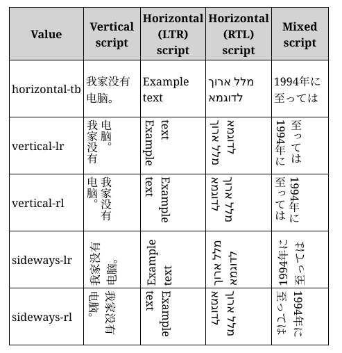
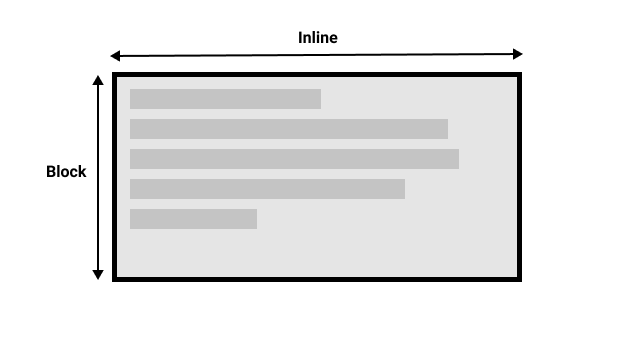
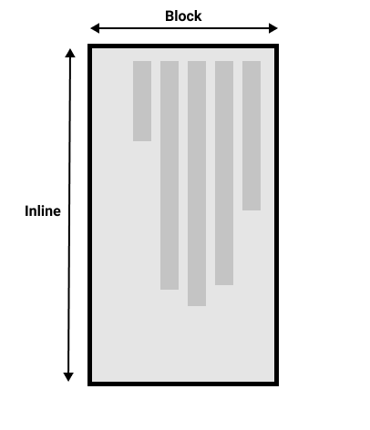

# 书写模式与逻辑属性

## writing-mode 如何控制书写方向？

```css
.example {
  writing-mode: horizontal-tb; /* 横向, 从左到右 */
  writing-mode: vertical-rl; /* 纵向, 从右到左 */
  writing-mode: vertical-lr; /* 纵向, 从左到右 */
}
```



## 块级布局与内联布局的方向由什么决定？

- inline: 文字方向;
- block: 段落方向;




## 逻辑属性解决什么问题？

- 目标: 用逻辑方向替代物理方向, 适配不同 writing-mode;
- 物理属性: `width`/`height`、`top`/`left`;
- 逻辑属性: `inline-size`/`block-size` 对应 inline 与 block 方向尺寸;

## padding、border、margin 的逻辑属性如何写？

- 四向: `xxx-block-start`、`xxx-block-end`、`xxx-inline-start`、`xxx-inline-end`;

```css
.box {
  margin-block-start: 1em;
  padding-inline-end: 2em;
  border-block-end: 1px solid;
}
```
