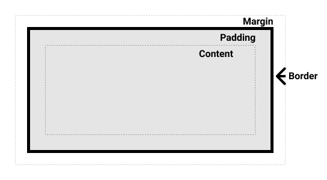
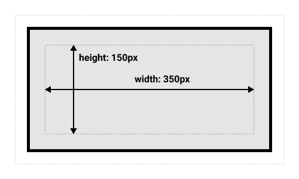
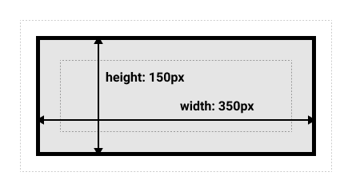

# 盒模型与尺寸

## 标准盒模型由哪几层组成？

- content box: 内容区;
- padding box: 内边距;
- border box: 边框;
- margin box: 外边距;



## width/height 默认作用于哪一层？

- 默认: width/height 只作用于 content box;
- 总占位: content box + padding box + border box;



## 替代盒模型有何不同？

- 机制: width/height 包含 padding box 与 border box;
- 好处: 设置尺寸后加 padding/border 不再撑大盒子;

```css
box {
  box-sizing: border-box;
}
```



## 如何全局启用 border-box？

- `:root` 设 `box-sizing: border-box`;
- 后代用 `box-sizing: inherit` 继承, 伪元素一并覆盖;

```css
:root {
  box-sizing: border-box;
}
*,
::before,
::after {
  box-sizing: inherit;
}
```

## 尺寸与最大最小约束如何设置？

- 基础: `width`、`height`, 取值 `auto`/percentage/length;
- 约束: `max-width`、`min-width`、`max-height`、`min-height`;

```css
table {
  width: 75%;
  max-width: 100px;
}
```

## 百分比尺寸基于什么计算？

- 基准: containing block 的对应尺寸;
- 注意: padding 百分比同样以父容器 inline size 为基准, 与 height 无关;
