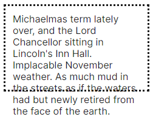

# 溢出处理

## overflow 在什么情况下产生？

- 原因: content box 容纳不下内容;
- 表现: 内容溢出到盒子外部;



## overflow 各取值有何区别？

```css
p {
  overflow: visible; /* 不裁剪, 默认 */
  overflow: hidden; /* 裁剪, 无滚动条, 可通过 js 滚动 */
  overflow: clip; /* 裁剪, 无滚动条, 不可通过 js 滚动 */
  overflow: scroll; /* 裁剪, 始终显示滚动条 */
  overflow: auto; /* 裁剪, 按需显示滚动条 */
}
```

## overflow 的成分属性与多值语法是什么？

- 成分属性: `overflow-x`、`overflow-y`;
- 1 值: 同时作用于 x 与 y;
- 2 值: x + y;

```css
.box {
  overflow-x: hidden;
  overflow-y: auto;
  overflow: hidden auto;
}
```
