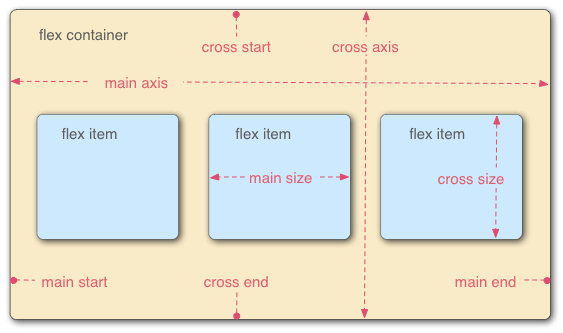

# flex 容器与轴

## flex 模型由哪些概念组成？

- main axis: main start → main end;
- cross axis: cross start → cross end;
- flex container: `display: flex` 的元素;
- flex items: 容器的直接子元素;
- main size / cross size: item 在两轴上的尺寸;



## flex-flow 简写如何书写？

- 作用: 设置 main axis 方向与换行方式;
- 成分属性: `flex-wrap`、`flex-direction`;

```css
element {
  flex-flow: column;
  flex-flow: column-reverse wrap;
}
```

## flex-direction 有哪些取值？

```css
#col-rev {
  flex-direction: row; /* 默认, inline-start → inline-end */
  flex-direction: row-reverse; /* inline-end → inline-start */
  flex-direction: column; /* block-start → block-end */
  flex-direction: column-reverse; /* block-end → block-start */
}
```

## flex-wrap 有哪些取值？

```css
.content {
  display: flex;
  flex-wrap: nowrap; /* 默认, 不换行 */
  flex-wrap: wrap; /* 换行, main-start → main-end */
  flex-wrap: wrap-reverse; /* 换行, main-end → main-start */
}
```
