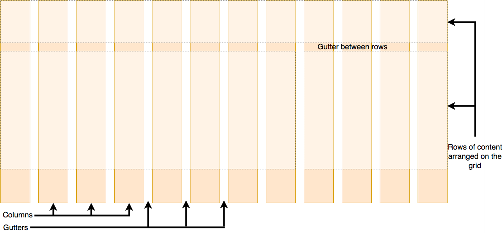

# grid 轨道与函数

## grid 布局由哪些部分组成？

- rows: 行轨道;
- columns: 列轨道;
- gutters: 轨道之间的空隙;
- `display: grid` 创建 grid container;



## grid-template-rows 如何定义轨道？

- 作用: 设置行名与行轨道大小;
- `grid-template-columns`: 列方向版本;

```css
.container {
  grid-template-rows: 1fr 2fr 1fr; /* flex 比例 */
  grid-template-rows: 10px max-content;
  grid-template-rows: 10px minmax(min, max);
  grid-template-rows: 10px repeat(2, 1fr);
  grid-template-rows: [linename1] 100px [linename2 linename3]; /* 命名线 */
}
```

## grid-auto-rows 与 grid-auto-columns 何时生效？

- 作用: 设置隐式轨道大小;
- 时机: `grid-template-rows` 缺省或为 `none`;
- 属性值同 `grid-template-rows`;

```css
#grid {
  display: grid;
  grid-auto-rows: 100px;
}
```

## repeat() 如何使用？

- 作用: 重复 track list 的简写;
- 参数: repeat count (`int`/`auto-fill`/`auto-fit`) + tracks;
- 可含多个 track size, 空格分隔并按序循环;

```css
#container {
  display: grid;
  grid-template-columns: repeat(2, 50px 1fr) 100px;
}
```

## minmax() 如何使用？

- 作用: 设置 track 的最小值与最大值;

```css
#container {
  grid-template-columns: minmax(min-content, 300px) minmax(200px, 1fr) 150px;
}
```

## auto-fill 与 auto-fit 有何区别？

- 相同: 重复次数取尽可能大的值, 使该方向不溢出, 最小为 1;
- 不同: 容器宽于所有子元素总宽时, `auto-fill` 保留空白轨道;
- `auto-fit`: 折叠空白轨道, 空间平均分给其他轨道;

## 如何实现尽可能多的列？

```css
.container {
  display: grid;
  grid-template-columns: repeat(auto-fill, minmax(200px, 1fr));
}
```
