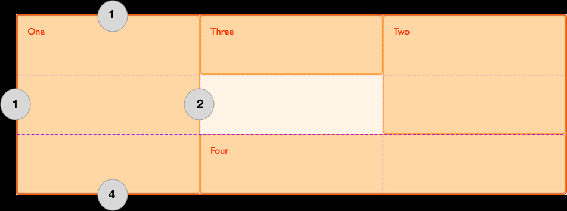

# grid 放置与区域

## 基于网格线如何放置 item？

- 用行/列起止线编号定位 item 并跨越多条轨道;



```css
#item {
  grid-column: 2 / 4; /* start / end */
}
```

## grid-column 的多值语法如何解析？

- 1 值: 只设 `grid-column-start`;
- 2 值: `grid-column-start / grid-column-end`;
- 成分属性: `grid-column-start`、`grid-column-end`;
- `grid-row`: 行方向版本, 同理;

## grid-column-start 有哪些取值？

```css
#item {
  grid-column-start: auto; /* 默认, 等同 span */
  grid-column-start: 2; /* 正数: 正数第 2 条线 */
  grid-column-start: -2; /* 负数: 倒数第 2 条线 */
  grid-column-start: span 2; /* 横跨 2 列 */
  grid-column-start: test; /* custom-ident 列名 */
}
```

## grid-template-areas 如何命名区域？

- 写法: 每行一个引号包裹的字符串, 行列用空格分隔;
- 与 `grid-row`/`grid-column`/`grid-area` 联用;

```css
#page {
  display: grid;
  grid-template-areas:
    "a a ."
    "a a ."
    ". b c";
  grid-template-rows: 50px 1fr 30px;
  grid-template-columns: 150px 1fr;
}
```

## 命名区域有哪些原则？

- 一旦使用必须填满所有网格;
- 用 `.` 表示该网格不命名;
- 命名区域必须为矩形;
- 同名区域必须相连;

## grid-area 如何使用？

- 命名区域: `grid-area: a` 把 item 放入该区域;
- 定位语法: `grid-row-start / grid-column-start / grid-row-end / grid-column-end`;

```css
#item1 {
  grid-area: 2 / 2 / auto / span 3;
}
```
