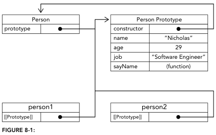
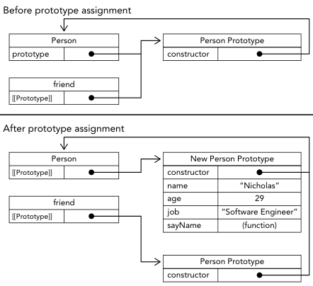
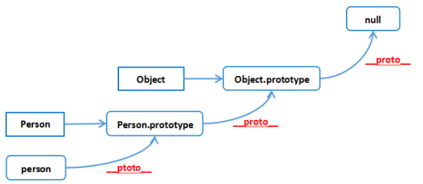

# 原型与原型链

## prototype 与 [[Prototype]] 分别是什么？

- `prototype`: 每创建一个函数, 引擎自动为其定义该属性, 指向原型对象;
- 原型对象: 普通对象, 自动带有 `constructor` 属性指回该函数;
- `[[Prototype]]`: 每个对象实例都有的内部槽, 指向创建它的构造函数的 `prototype`;
- 访问形式: `[[Prototype]]` 在浏览器中常以 `__proto__` 暴露;
- 共享: 同一构造函数创建的所有实例指向同一个 `prototype`;



```js
function Person() {}
const person1 = new Person();
person1.__proto__ === Person.prototype; // true
Person.prototype.constructor === Person; // true
```

## 属性访问如何沿原型链进行？

- 顺序: 先在实例自身查找属性名, 未找到再沿 `[[Prototype]]` 逐层向上查找;
- 终止: 直到 `null` 仍无该属性则返回 `undefined`;
- 写操作: 赋值在属性所在层生效, 若只存在于原型上, 会先在实例上新建同名属性形成遮蔽;

## 重写 prototype 会造成什么问题？

- 原因: 已创建的实例只保存对旧原型对象的引用, 替换 `Person.prototype` 不会更新旧实例的引用;

```js
function Person() {}
const friend = new Person();
Person.prototype = { constructor: Person, sayName() {} };
friend.sayName(); // TypeError; friend 仍指向旧原型
```



- 最佳实践: 一次性把方法定义在原型对象上, 避免创建实例后再整体替换;

## 完整原型链是怎样的？

```js
person1.__proto__ === Person.prototype; // 实例指向构造函数原型
Person.__proto__ === Function.prototype; // 函数本身也是函数对象
Person.prototype.__proto__ === Object.prototype; // 原型对象是普通对象
Object.__proto__ === Function.prototype; // Object 本身也是函数对象
Object.prototype.__proto__ === null; // 链条终点
```



- 推论: `instanceof` 沿该链条判断, `__proto__` 链也解释了所有引用值 `instanceof Object` 恒为真, 见 [类型概览与判定](../002-数据类型/010-类型概览与判定.md);
