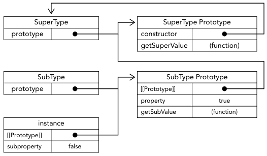
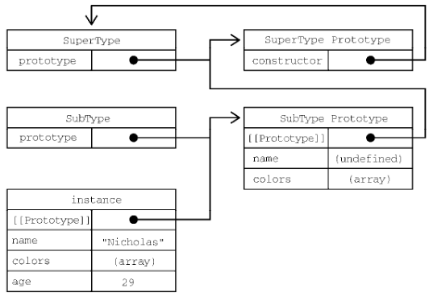

# 继承模式

## 原型链继承有什么问题？

- 做法: 把子类 `prototype` 设为父类实例, 通过原型链复用父类属性与方法;

```js
function SuperType() {
  this.property = true;
}
SuperType.prototype.getSuperValue = function () {
  return this.property;
};
function SubType() {
  this.subproperty = false;
}
SubType.prototype = new SuperType();
new SubType().getSuperValue(); // true
```



- 问题: 父类上的引用值属性被所有实例共享, 一个实例修改会影响其余实例;
- 问题: 创建子类实例时无法向父类构造函数传参;

## 盗用构造函数解决了什么, 又缺什么？

- 做法: 在子类构造函数中用 `SuperType.call(this, ...)` 执行父类构造函数, 把属性复制到当前实例;

```js
function SubType(name) {
  SuperType.call(this, name);
  this.age = 29;
}
```

- 优点: 每个实例各持一份属性, 且可以传参;
- 缺点: 父类原型上的方法无法继承, 方法也不能复用;

## 组合继承如何兼顾两者, 代价是什么？

- 做法: 用盗用构造函数继承实例属性, 用原型链继承原型方法;

```js
function SubType(name, age) {
  SuperType.call(this, name); // 继承属性
  this.age = age;
}
SubType.prototype = new SuperType(); // 继承方法
```



- 代价: 父类构造函数被调用两次, 子类原型上多出一份冗余的实例属性;

## 寄生式继承与寄生式组合继承是什么？

- 寄生式继承: 以原型链继承为基础, 少创建一个父类实例, 再给返回的对象添加方法;

```js
function object(o) {
  function F() {}
  F.prototype = o;
  return new F(); // 等价于 Object.create(o)
}
function createAnother(original) {
  const clone = object(original);
  clone.sayHi = function () {
    console.log("hi");
  };
  return clone;
}
```

- 寄生式组合继承: 用 `Object.create(SuperType.prototype)` 设置子类原型, 避免调用父类构造函数, 保留原型链的同时消除冗余属性;

```js
function Sub(name, age) {
  Sup.call(this, name);
  this.age = age;
}
Sub.prototype = Object.create(Sup.prototype);
Sub.prototype.constructor = Sub;
Sub.prototype.sayAge = function () {
  console.log(this.age);
};
```

- 现代口径: `class extends` 的继承语义正是寄生式组合继承, 见 [class](./040-class.md);
