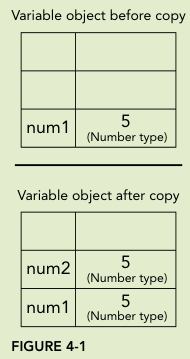
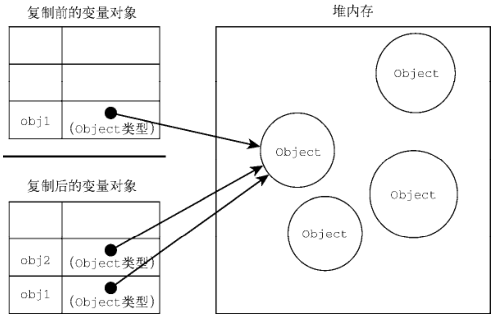

# 原始值与引用值

## 原始值与引用值如何存储？

- 原始值: `undefined`、`null`、`boolean`、`number`、`string`、`symbol`, 直接存在栈上, 变量保存其实际值;
- 引用值: `object`, 值存在堆上, 栈上只保存指向堆的地址;
- 操作差异: 原始值操作的是栈上的实际值, 引用值操作的是其引用;

## 为什么原始值不能添加属性？

```js
let name = "Nicholas";
name.age = 27;
console.log(name.age); // undefined; 写入的是临时包装对象

const person = {};
person.name = "Nicholas";
console.log(person.name); // "Nicholas"
```

- 原因: 原始值没有属性, 读取或写入时会临时包装再销毁, 详见 [原始包装类型](../002-数据类型/070-原始包装类型.md);
- 引用值: 属性保存在堆上的对象中, 可以持续存在;

## 复制值时两者有什么区别？

- 原始值: 在栈上创建新空间并复制实际值, 两个变量完全独立;



- 引用值: 在栈上创建新空间并复制地址, 两个变量指向堆上的同一个对象;

```js
const obj1 = {};
const obj2 = obj1;
obj1.name = "Nicholas";
console.log(obj2.name); // "Nicholas"
```



## 函数参数是按值还是按引用传递？

- 统一口径: JavaScript 的参数全部按值传递;
- 原始值参数: 传实际值副本, 函数内修改不影响外部;
- 对象参数: 传地址副本, 函数内修改对象内容会影响外部; 但在函数内给参数重新赋新对象, 不会改变外部变量;

```js
function setName(obj) {
  obj.name = "Nicholas"; // 修改原对象, 外部可见
  obj = {}; // 只改变局部副本
  obj.name = "Greg";
}
const person = {};
setName(person);
console.log(person.name); // "Nicholas"
```
