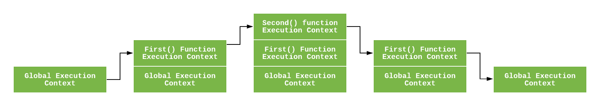

# 执行上下文与词法环境

## 词法环境由什么组成？

- 语义: 定义标识符与变量、函数等绑定关系的结构;
- 组成: Environment Record (保存绑定)、`outer` (指向外层词法环境)、`this` (该环境绑定的 this);
- Environment Record 分类:
  - Declarative Environment Record: 函数环境记录与模块环境记录属于此类;
  - Object Environment Record: 由 `with` 创建的记录;
  - Global Environment Record: 全局上下文使用;

## this 在各类上下文中如何确定？

- 全局上下文: 严格模式为 `undefined`, 非严格模式为全局对象;
- 普通函数: 由调用点决定, 见 [this 绑定](../005-函数/030-this绑定.md);
- 箭头函数: 创建时该环境没有 this 绑定, 沿 `outer` 找到最近的 this;

## 执行上下文由什么组成？

- LexicalEnvironment: 保存 `let`/`const`/`function` 等声明的绑定;
- VariableEnvironment: 保存 `var` 声明的绑定;
- 类型: 全局执行上下文是默认上下文; 每次调用函数都会新建一个函数执行上下文;

## 执行栈如何管理上下文？

- 机制: 代码执行期间的上下文保存于栈中;
- 流程: 程序启动时压入全局上下文 → 调用函数时压入新的函数上下文 → 函数返回时弹出栈顶;
- 关联: 上下文的 `outer` 连接关系构成作用域链, 见 [作用域与作用域链](./030-作用域与作用域链.md);



## 上下文的创建与执行阶段分别做什么？

- 创建阶段: 建立 `LexicalEnvironment` 与 `VariableEnvironment`, 确定 this; 此时 `var` 绑定为 `undefined`, `let`/`const` 为未初始化 (`<uninitialized>`);
- 执行阶段: 逐句执行代码并完成变量赋值;

```js
let a = 20;
const b = 30;
var c;
function multiply(e, f) {
  var g = 20;
  return e * f * g;
}
c = multiply(20, 30);
```

## var 提升的本质是什么？

- 机制: 创建阶段变量环境把 `var` 绑定初始化为 `undefined`;
- 结果: `var` 声明可在语句之前使用;
- 对比: `let`/`const` 创建阶段不初始化, 语句之前访问进入暂时性死区并抛 `ReferenceError`, 见 [变量声明](../001-语言基础/030-变量声明.md);

## 为什么要区分 LexicalEnvironment 与 VariableEnvironment？

- 起因: ES6 引入 `let`/`const` 的块级作用域;
- 块执行流程: 保存当前词法环境为 `oldEnv` → 新建块级 Declarative 环境 (无 this 绑定, `outer` 为 `oldEnv`) → 将块内声明登记到对应环境 → 执行块 → 执行完恢复 `oldEnv`;
- 结果: 块内 `let`/`const`/函数声明只存在于临时词法环境, 块外不可见;
- 例外: `var` 声明会写回外层变量环境, 因此在块外仍可访问;

```js
const a = 1;
{
  const a = 2;
  var test0 = function () {};
  console.log(a); // 2
}
console.log(a); // 1; 块内 a 已随临时环境移除
console.log(test0()); // undefined; var 提升了 test0
```

## 执行上下文增强是什么？

- 机制: 特定语句在执行期临时在作用域链前端插入一个上下文, 语句结束后移除;
- 语句: `try...catch` 的 `catch` 块, 以及不推荐的 `with`;
- `with` 例子: 把对象上下文临时移到函数上下文之前, 因此可以访问函数内变量并在对象上创建属性, 见 [跳转语句与 with](../003-运算符与语句/050-跳转语句与with.md);
