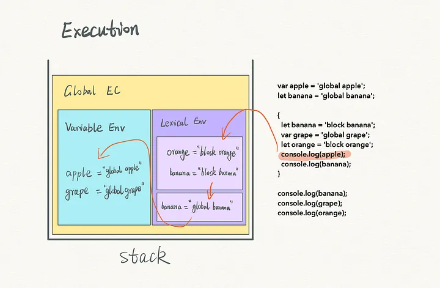

# 作用域与作用域链

## 作用域是什么？

- 定义: 某标识符可以访问到的词法环境;
- 决定因素: 声明所在位置, 而不是调用位置;

## 作用域分为哪几类？

- 全局作用域: 保存在全局执行上下文的词法环境或变量环境中, 可被执行栈上任意上下文访问;
- 函数作用域: 保存在对应函数执行上下文中, 可被其下级上下文访问;
- 块级作用域: 保存在 `{}` 临时创建的词法环境中, 只对该环境内的标识符可见;

## 作用域链如何连接？

- 机制: 逐层通过词法环境的 `outer` 指针连接, 形成从当前上下文到全局上下文的链条;
- 基础: 执行栈与上下文的创建细节见 [执行上下文与词法环境](./020-执行上下文与词法环境.md);
- 表现: 内层作用域可以访问外层变量, 外层不能访问内层变量;

## 标识符查找顺序是什么？

1. 在当前执行上下文中查找: 先查 `LexicalEnvironment`, 再查 `VariableEnvironment`;
2. 沿作用域链逐级向上查找 `outer`;
3. 直到全局上下文仍找不到则抛 `ReferenceError` (读取) 或创建全局属性 (非严格模式赋值);

