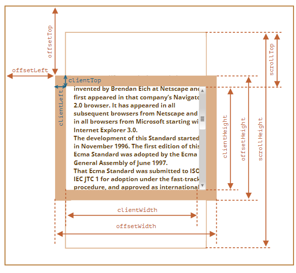
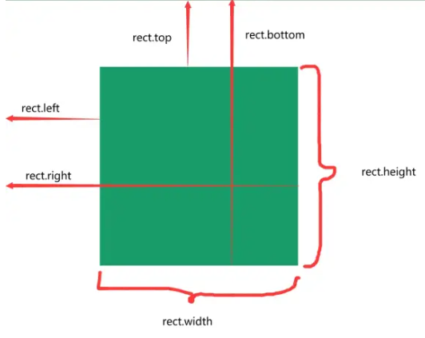

# 样式与尺寸

## 如何读写元素样式？

```js
const myDiv = document.getElementById("myDiv");
myDiv.style.backgroundColor = "red"; // 单个属性用驼峰
myDiv.style.cssText = "width: 25px; height: 100px"; // 批量设置
myDiv.style.getPropertyValue("height"); // 读取
myDiv.style.removeProperty("border"); // 移除
for (let i = 0; i < myDiv.style.length; i++) console.log(myDiv.style[i]); // 迭代
```

- 读取口径: `element.style` 只包含行内样式, 最终生效值要用 `getComputedStyle`;

## 如何操作样式表与计算样式？

```js
document.styleSheets[0].cssRules; // 规则集合
const rule = document.styleSheets[0].cssRules[0];
rule.selectorText; // 规则的选择符
rule.style; // CSSStyleDeclaration
document.styleSheets[0].insertRule("body { margin: 0 }", 0); // 插入规则
document.styleSheets[0].deleteRule(0); // 删除规则

const style = window.getComputedStyle(box, "after"); // 指定伪元素可选
style.getPropertyValue("height");
```

- `getComputedStyle`: 返回元素最终生效的 CSSStyleDeclaration, 只读;

## 三类尺寸分别表示什么？



| 类别       | 组成                         | 含义                                 |
| ---------- | ---------------------------- | ------------------------------------ |
| 偏移尺寸   | `content + padding + border` | 元素占用的视觉空间, 如 `offsetWidth` |
| 客户端尺寸 | `content + padding`          | 元素可见内容空间, 如 `clientWidth`   |
| 滚动尺寸   | 总内容 (含不可见部分)        | 内容整体尺寸, 如 `scrollWidth`       |

- 偏移量: `offsetLeft`/`offsetTop` 相对偏移父级, `clientLeft`/`clientTop` 为边框宽度, `scrollLeft`/`scrollTop` 为滚动偏移;

```js
// 无滚动条时: scrollWidth === clientWidth
// 有滚动条时: scrollLeft + clientWidth === scrollWidth
```

## getBoundingClientRect 返回什么？



| 属性                                | 含义                    |
| ----------------------------------- | ----------------------- |
| `x` / `y`                           | 左 / 上边界相对视口坐标 |
| `width` / `height`                  | 元素宽高                |
| `top` / `right` / `bottom` / `left` | 四边相对视口的距离      |

```js
const rect = box.getBoundingClientRect();
```
