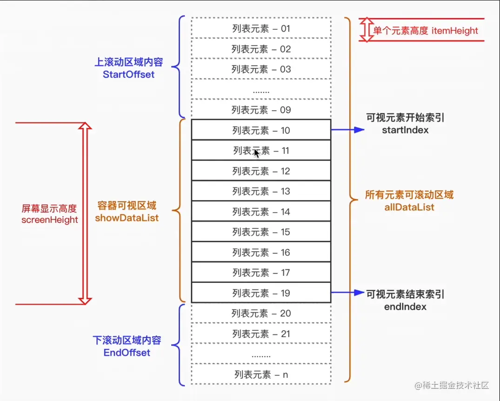

# DOM 性能实践

## 如何判断元素是否在可视区域？

- `getBoundingClientRect` 方案: 比较元素四边与 `window.innerHeight`/`innerWidth`;
- `IntersectionObserver` 方案: 直接读取交叉状态;

| 判定     | getBoundingClientRect 口径                  | IntersectionObserver 口径       |
| -------- | ------------------------------------------- | ------------------------------- |
| 部分包含 | `top > 0 && top < innerHeight`, `left` 同理 | `intersectionRatio` 在 `(0, 1)` |
| 完全包含 | `top > 0 && bottom < innerHeight`, 左右同理 | `intersectionRatio === 1`       |

## 上拉加载与下拉刷新如何实现？

- 上拉加载: 触底时加载下一页;

```js
if (scrollTop + clientHeight >= scrollHeight - distance) {
  // 触发加载
}
```

- 下拉刷新: 监听 `touchstart`/`touchmove`/`touchend`, 用 `translateY` 跟随下拉, 松手后触发刷新并复位;

## 大数据量列表如何渲染？

| 方案                    | 要点                                                                                          |
| ----------------------- | --------------------------------------------------------------------------------------------- |
| 直接渲染                | 数据量大时不可取                                                                              |
| `setTimeout` 分页渲染   | 按页拆分, 逐页渲染, 减少单帧压力                                                              |
| `requestAnimationFrame` | 用 RAF 替代定时器, 与刷新率对齐                                                               |
| 文档碎片 + RAF          | 先在内存中构建 `DocumentFragment`, 再一次性插入, 减少重排重绘                                 |
| 懒加载                  | 页尾放空节点, 用 `getBoundingClientRect` 或 `IntersectionObserver` 观察, 进入视口再渲染下一页 |
| 虚拟列表                | 见下                                                                                          |

## 虚拟列表的实现机制是什么？

1. 固定可视区高度 `showHeight` 与列表项高度 `itemHeight`;
2. 由滚动位置计算渲染区间, 并预留缓存项避免滑动卡顿;
   - `start = Math.floor(scrollTop / itemHeight) - buffer`;
   - `end = start + Math.ceil(showHeight / itemHeight) + buffer`;
3. 监听滚动, 只渲染 `start` 到 `end` 的列表项, 用绝对定位把首项放到 `startIndex * itemHeight` 的位置;
4. 滚动回调使用节流, 避免高频渲染;



- 前置能力: 滚动尺寸与元素位置读取见 [样式与尺寸](./050-样式与尺寸.md), 观察器见 [观察者 API](./060-观察者API.md);
