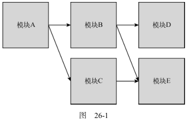

# 模块模式演变

## 模块要解决哪些问题？

- 依赖关系: 用有向图描述模块之间的依赖;
- 加载策略:
  - 同步加载: 按顺序加载, 会阻塞进程且需要人工管理顺序;
  - 异步加载: 按需加载并在完成后执行回调;
  - 动态加载: 运行时决定是否加载, 增加静态分析难度;
- 静态分析: 不执行代码就推断其行为, 是打包与摇树优化的前提;
- 循环依赖: 模块之间互相引用, 需要明确初始化时序;



## 模块方案的演进顺序是什么？

- 命名空间: 导出一个承载若干类的对象, 可配合 IIFE 暴露静态方法;
- CommonJS: Node.js 的同步模块方案, 用 `require` 加载、`module.exports` 导出;

```js
var moduleB = require("./moduleB");
module.exports = { stuff: moduleB.doStuff() };
```

- AMD: 浏览器端异步模块定义, 用 `define` 声明依赖与工厂;

```js
define("moduleA", ["require", "exports"], function (require, exports) {
  var moduleB = require("moduleB");
  exports.stuff = moduleB.doStuff();
});
```

- UMD: 同时兼容 CommonJS 与 AMD;
- ES6 模块: 语言级标准模块系统, 静态结构可分析;

## 为什么 ESM 能被静态分析？

- 语法限制: 导入导出必须在顶层, 且导出名在解析阶段即可确定;
- 收益: 构建工具可以提前构建依赖图, 支持摇树与代码分割;
- 对比: CommonJS 的 `require` 可以出现在任意位置, 依赖关系要在运行时才能确定;
