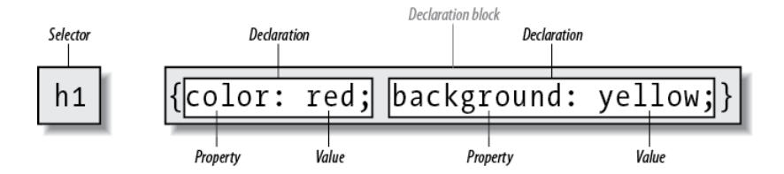

# css 绪论

## 样式表

### css rule 结构



### 外部样式表

- link 标签;

```html
<!DOCTYPE html>
<html>
  <head>
    <meta charset="utf-8" />
    <title>My CSS experiment</title>
    <link rel="stylesheet" href="styles.css" />
  </head>
  <body>
    <h1>Hello World!</h1>
    <p>This is my first CSS example</p>
  </body>
</html>
```

### 内部样式表

- style 标签;

```html
<!DOCTYPE html>
<html>
  <head>
    <meta charset="utf-8" />
    <title>My CSS experiment</title>
    <style>
      h1 {
        color: blue;
        background-color: yellow;
        border: 1px solid black;
      }

      p {
        color: red;
      }
    </style>
  </head>
  <body>
    <h1>Hello World!</h1>
    <p>This is my first CSS example</p>
  </body>
</html>
```

### 内联样式

- style 属性;
- 避免使用, 可维护性差;

```html
<!DOCTYPE html>
<html>
  <head>
    <meta charset="utf-8" />
    <title>My CSS experiment</title>
  </head>
  <body>
    <h1 style="color: blue;background-color: yellow;border: 1px solid black;">Hello World!</h1>
    <p style="color:red;">This is my first CSS example</p>
  </body>
</html>
```

## 基本语法

### 空白

#### 分类

- 空格;
- 换行符;
- 制表符;

##### 浏览器空白机制

- 多余空白被浏览器忽略;

##### 作用

- 空白分隔属性值;
- 空白提高代码可读性;

### css 注释

```css
/* comment */
```

### 浏览器解析 css 原则

- 成功解析则应用;
- 否则忽略;

## 回流和重绘

### 基本概念

#### 回流(重排)

- 布局或几何属性变化;
- 重新构建布局树并重绘页面;
- 性能开销高;

##### 重绘

- 元素样式变化;
- 更新渲染树, 不改变布局树;
- 性能开销低于回流;

##### 回流与重绘的关系

- 回流一定导致重绘;
- 重绘不一定导致回流;

### 触发操作

#### 回流

- 修改窗口;
  - 尺寸;
- 修改文本样式;
  - 大小;
  - 字体类型;
- 修改元素;
  - 盒子模型布局相关;
  - 子元素;
- 修改布局;
  - float/clear;
  - display;
- 添加/删除样式表;

##### 重绘

- 修改元素样式;
  - 元素颜色;
  - 可见性/透明度;
  - 盒子模型样式相关: radius/shadow;
- 修改文本样式;
  - 文本装饰;
  - 字体属性;
- 修改背景;
  - 背景图片;
  - 背景颜色;

### 优化

- 避免频繁修改元素样式: 使用添加/删除类名改变样式;
- 使用 transform 改变元素位置和大小;
  - 只影响浏览器渲染中的 draw 阶段;
- 对于频繁变化的元素, 使用 absolute 布局使其脱离文档流, 避免影响其他元素;
- 隐藏而非删除 DOM 元素;
- 多次操作的元素进行缓存;

### documentFragment

- DocumentFragment: 轻量 DOM 容器, 不渲染到页面;
- 内存中操作 DOM 节点, 不触发回流和重排;
- 批量提交 DOM, 减少 DOM 操作次数;

```typescript
// 创建 DocumentFragment 对象
var frag = document.createDocumentFragment();

// 批量写入内存中的 DocumentFragment
for (var i = 0; i < 10; i++) {
  var li = document.createElement("li");
  li.innerText = "List item " + i;
  frag.appendChild(li);
}

// 一次性提交到 DOM
document.querySelector("ul").appendChild(frag);
```

## css 预处理器

### 基本概念

- CSS 扩展语言;
- 扩展 CSS 语法和特性;
- 提高 CSS 编程能力、复用性和可维护性;

### 常见 css 预处理器

- sass;
- less;
- stylus;

### 常见特性

- 变量: 提高 CSS 复用性;
- 作用域;
- 代码混入: 样式片段模块化复用;
- 嵌套;
- 模块化;

## css in js 和原子化 css

### css in js

#### css in js 定义

- JS 中定义 CSS 样式;
- 运行时动态生成 CSS 样式;

##### 优点

- 无全局样式冲突;
- 实现动态样式;
- 减少命名冲突;
- 结合 JS, 便于组件化和模块化;

##### 缺点

- 运行时动态生成, 降低渲染性能;
- 增加包体积;
- 调试困难;

### 原子化

#### 原子化 css 定义

- 原子化 CSS: 将样式拆为小型独立单元;
- 组合原子类实现复杂样式;

##### 优点

- 命名固定且唯一, 减少命名负担和命名冲突;
- 样式复用性强, 减少包体积, 提高渲染性能;
- 自带设计系统, 样式统一;
- 状态管理和响应式设计;

##### 缺点

- 记忆负担;
- 复杂样式命名过多, 难以阅读和维护;
