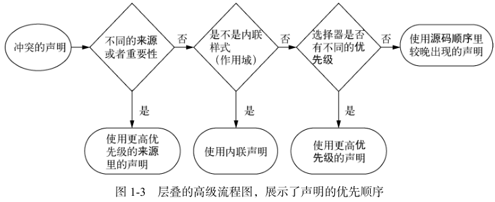

# 层叠, 优先级和继承

## 层叠

### 基础

#### 层叠

- 层叠: CSS 规则冲突时的取值机制;

##### 机制

- relevance;
- cascade origin 和 importance;
- cascade layer;
- 选择器优先级;
- scoping proximity;
- 源码顺序;



### 层叠排序模型

#### relevance

- relevance: 只保留当前环境匹配的声明;
  - media query 匹配;
  - supports query 匹配;

##### origin 和 importance

- origin/importance: 不同来源和 `!important` 声明的优先级层级;
- origin: CSS 声明来源;
  - user-agent: 浏览器默认样式;
  - user: 用户自定义样式;
  - author: 页面作者样式;
- importance: CSS 声明是否带 `!important`;
- `!important`: 将声明提升到对应 origin 的 important 层级;
- 同一 origin/importance 内继续比较 cascade layer、specificity、scoping proximity、source order;

| 优先级 | 来源 |
| ------ | ---- |
| 低 | user-agent normal |
| | user normal |
| | author normal |
| | keyframes animation |
| | author !important |
| | user !important |
| | user-agent !important |
| 高 | transition |

```css
/* author normal */
p {
  color: red;
}

/* author important */
p {
  color: blue !important;
}
```

##### cascade layer

- cascade layer: 同一 origin/importance 内按 layer 排序;
- normal declaration;
  - 未分层声明优先于分层声明;
  - 后声明 layer 优先于先声明 layer;
- important declaration;
  - 分层声明优先于未分层声明;
  - 先声明 layer 优先于后声明 layer;

```css
@layer base, components;

@layer base {
  button {
    color: black;
  }
}

@layer components {
  button {
    color: blue;
  }
}
```

##### specificity

- specificity: 同一 origin/importance/layer 内比较选择器优先级;
- inline style specificity 高于普通选择器;

##### scoping proximity

- scoping proximity: `@scope` 中作用域根更近的声明优先;
- 生效前提: origin/importance、cascade layer、specificity 均相同;

```html
<div class="card">
  <section class="content">
    <p>Text</p>
  </section>
</div>
```

```css
@scope (.card) {
  p {
    color: red;
  }
}

@scope (.content) {
  p {
    color: blue;
  }
}
```

##### source order

- source order: 前面规则均相同, 后声明覆盖先声明;

### 选择器优先级

- Identifiers + Classes + Elements;
  - Identifiers: ID 选择器;
  - Classes: 类选择器, 属性选择器, 伪类;
  - Element: 元素选择器, 伪元素选择器;
- 三元组数值越大, specificity 越高;

| 选择器        | Identifiers | Classes | Elements | 特殊性 |
| ------------- | ----------- | ------- | -------- | ------ |
| h1            | 0           | 0       | 1        | 001    |
| p.class       | 0           | 1       | 0        | 010    |
| h1 + p[class] | 0           | 1       | 1        | 011    |
| \#id          | 1           | 0       | 0        | 100    |

## 继承

### 基础

#### 继承

- 继承: 子元素使用父元素属性值;

##### 可继承属性和不可继承属性

- 可继承属性: 样式类属性;
  - font 相关;
  - color 相关;
  - text 相关;
  - list 相关;
- 不可继承属性: 布局和尺寸类属性;
  - 盒子模型相关;
  - position 相关;
  - float 相关;
  - display 相关;

### 特殊值

- inherit: 表明子标签使用父标签对应样式;
- initial: 表明子标签使用浏览器默认值;
- unset;
- revert;
- all;
