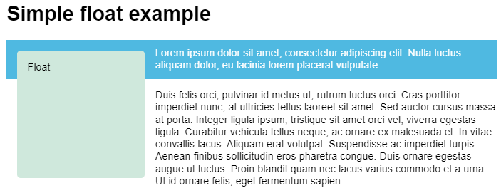

# floats

## float 布局

### float 布局

- float: 让元素脱离 normal flow 并向 inline 方向浮动;

```css
section {
  float: none;
  float: left;
  float: right;
  float: inline-start;
  float: inline-end;
}
```

### float 和 normal flow 的关系

- float 所属标签与 normal flow 分离;
- float 所属标签位于 normal flow 层级之上;

### 浮动问题

- float 脱离了 normal flow;
- float 影响 normal flow 中的 content box;
- float 不影响 normal flow 中的 padding 和 margin box;
- float 问题: 父元素高度无法包住浮动子元素;



### 清除浮动

#### 思路

- 通过 clear 属性;
- 通过块级上下文;

##### clear 属性

- clear: 控制元素是否下移到前置浮动元素底部;

```css
.left {
  border: 1px solid black;
  /* 不移动 */
  clear: none;
  /* 左侧浮动标签底部 */
  clear: left;
  /* 右侧浮动标签底部 */
  clear: right;
  /* 左右侧标签底部 */
  clear: both;
  /* 逻辑属性 */
  clear: inline-start;
  clear: inline-end;
}
```

##### clearfix hack

- `.wrapper::after`: 生成空子元素;
- `display: block` + `clear: both`: 让空子元素位于浮动子元素底部;
- 父元素高度被空子元素撑开;

```css
.wrapper::after {
  content: "";
  clear: both;
  display: block;
}
```

##### overflow

- 创建块级上下文;
- overflow 属性值非 visible 即可;

```css
.wrapper {
  background-color: rgb(79, 185, 227);
  padding: 10px;
  color: #fff;
  overflow: auto; /* other than visible */
}
```

##### display

- 创建块级上下文;
- 推荐使用 `display: flow-root`;
  - flex/grid 亦可;

```css
.wrapper {
  background-color: rgb(79, 185, 227);
  padding: 10px;
  color: #fff;
  display: flow-root;
}
```
