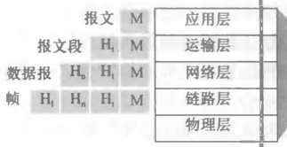

# 协议分层与封装

## 为什么要用分层的方式组织协议?

- 协议分层（protocol layering）: 以分层的方式组织协议，某个协议属于某一层，只解决该层关心的问题;
- 协议栈（protocol stack）: 各层所有协议的集合; 数据自上而下穿过协议栈，每层只管自己那一段;
- 分层的好处: 把"寻址、可靠传输、路由、物理信号"这些互相独立的问题分开处理，概念化和结构化，某一层换实现不影响其他层;
- 分层的代价: 每层都要加自己的首部，带来额外开销; 层与层之间的信息隐藏也可能让跨层优化变得困难;

## 因特网协议栈和 OSI 模型有什么不同?

- 因特网协议栈（5 层）: 自上而下为应用层、运输层、网络层、链路层、物理层;
- ISO OSI 参考模型（7 层）: 自上而下为应用层、表示层、会话层、运输层、网络层、链路层、物理层;
- 相同的 5 层: 两套模型的 5 层含义大致相同，运输层以下的分工没有实质差别;
- 差异只在应用层之上: OSI 在应用层与运输层之间多出表示层和会话层，因特网模型把这两层的工作交给应用层自己完成;

## OSI 多出来的表示层和会话层做什么?

- 表示层（presentation layer）: 负责数据如何描述，即把数据在机器内部表示与网络传输格式之间做转换;
- 会话层（session layer）: 负责数据的交换、同步和恢复，即管理一段对话的开始、中断与继续;
- 因特网模型的做法: 应用层同时承担表示层和会话层的工作，具体格式与状态由应用协议自己定义;

## 封装如何把上层数据变成下层能传送的东西?

- 封装（encapsulation）: 下一层分组在上一层分组的基础上额外添加信息（首部），形成本层的分组;
- 逐层加首部: 应用层产生的报文 M，经运输层加首部 Ht 变成报文段 HtM，经网络层加首部 Hn 变成数据报 HnHtM，经链路层加首部 Hl 变成帧 HlHnHtM;
- 首部的作用: 每一层的首部只携带本层需要的信息，如运输层的端口号、网络层的 IP 地址、链路层的 MAC 地址;
- 解封装: 接收端自下而上逐层剥掉本层首部，把数据交给上一层，直到应用层拿到原始报文;

