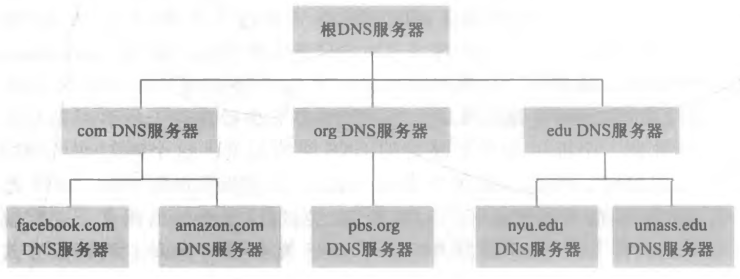
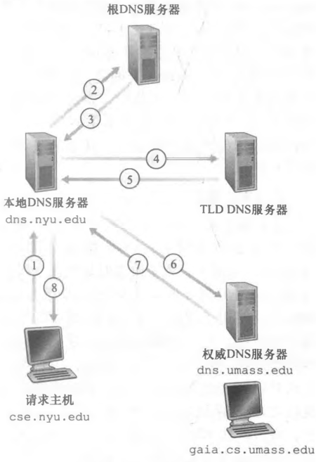

# DNS 基础与查询

## DNS 是什么，为什么需要它?

- DNS（Domain Name System，域名系统）: 由 DNS 服务器实现的分布式数据库; 它把分散在各处的记录拼成一套可查询的目录;
- 目录服务: 提供将 URL 的主机名到 IP 地址转换的服务; 人记得住名字，机器只认 IP 地址，中间需要一层翻译;
- 为什么是分布式的: 记录不集中放在一台服务器上，而是分散在大量 DNS 服务器中;
- RFC 1034 和 RFC 1035: 定义 DNS 的文档;
- 运输层: 基于 UDP，使用 53 端口;

## DNS 除了把主机名换成 IP 还能做什么?

- 主机别名: 让一台主机拥有便于使用的另一个名字;
- 邮件服务器别名: 让邮件服务器拥有便于使用的另一个名字;
- 负载分配: 一个主机名可以具有多个 IP 地址，对应多台服务器; DNS 服务器可实现负载均衡;

## 为什么 DNS 用 UDP 而不用 TCP?

- 报文特征: DNS 报文数据量小，报文数量多;
- 好处: 使用 UDP 协议速度快、首部开销小，减轻服务器负担;
- 取舍: 查询频繁、单次数据量小，才让 UDP 在速度与首部开销上的优势变得重要;

## DNS 服务器是怎样分层组织的?

- 层次结构: 分为根 DNS 服务器、顶级域 DNS 服务器、权威 DNS 服务器;
- 根 DNS 服务器: 层次结构的最顶层;
- 顶级域 DNS 服务器: 位于根之下、按顶级域划分的那一层;
- 权威 DNS 服务器: 知道某个域对应的 IP 地址、能给出最终答案的服务器;

## 本地 DNS 服务器扮演什么角色?

- 本地 DNS 服务器: 不属于 DNS 的层次结构; 它站在层次结构之外，替客户跑腿;
- 归属: 每一个 ISP 具有一台本地 DNS 服务器;
- 作用: 起中转和缓存作用，具有减少查询流量的作用; 客户的请求先交给它，由它继续追问;

## 一次域名解析要走哪几步?

- DNS 客户端: 客户端上运行的程序; 浏览器从 URL 提取主机名，发送给 DNS 客户端;
- 请求报文: DNS 客户端向 DNS 服务器发送一个包含主机名的请求;
- 递归查询: 客户向本地 DNS 服务器发送请求报文; 本地 DNS 服务器若存在缓存就返回 IP 地址，否则进行迭代查询;
- 迭代查询: 本地 DNS 服务器先向根 DNS 服务器发送请求报文，返回一个 TLD DNS 的 IP 地址; 再向 TLD DNS 服务器发送请求报文，返回一个权威 DNS 的 IP 地址; 最后向权威 DNS 服务器发送请求报文，返回主机名的 IP 地址;
- 回复: DNS 客户端收到一个回复报文，其中包含主机名对应的 IP 地址;
- 后续: 浏览器接收到 IP 地址后，向该 IP 地址的 80/443 端口的进程发送一个 TCP 连接;

## DNS 缓存为什么能减少查询流量?

- DNS 缓存: DNS 服务器接收到一个回复报文后，把结果缓存到本地一段时间;
- 命中: 若另一台主机进行相同的查询，直接返回缓存中的结果，不必重新走一遍查询;
