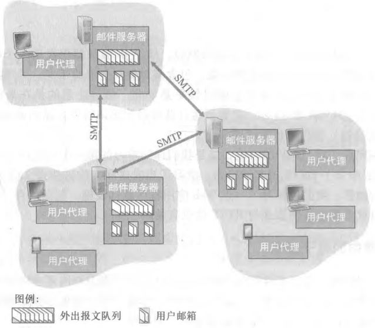

# 电子邮件与 SMTP

## 电子邮件系统由哪几部分组成?

- 用户代理（user agent）: 用户用来写信、读信的程序; 用户代理从邮件服务器发送和接收邮件;
- 邮件服务器（mail server）: 真正存放和转发邮件的服务器; 用户的信箱与待发邮件都放在这里;
- 简单邮件传输协议（SMTP）: 邮件在邮件服务器之间传输时使用的协议; 它是电子邮件系统的第三部分;
- 三者的分工: 用户代理与人打交道，邮件服务器负责存与转，SMTP 负责把邮件从一台服务器送到另一台服务器;

## 一封邮件从发件人到收件人走了哪些路?

- 第一步: 发送方的用户代理把邮件交给发送方的邮件服务器;
- 第二步: 邮件通过 SMTP 在发送方的邮件服务器和接收方的邮件服务器之间传输;
- 第三步: 接收方的用户代理从接收方的邮件服务器取走邮件;
- 两段传输的分工: 邮件服务器之间这一段由 SMTP 负责; 用户代理与邮件服务器之间这一段由邮件访问协议负责;

## 接收方邮件服务器不可用时会怎样?

- 重试机制: 若接收方邮件服务器无法正常工作，邮件在发送方邮件服务器保持一段时间，并不断尝试发送;
- 位置: 邮件停在发送方的邮件服务器上，等待接收方恢复;
- 代价: 这段时间里邮件一直留在发送方邮件服务器上，投递被推迟;

## SMTP 是什么，负责什么?

- SMTP（Simple Mail Transfer Protocol，简单邮件传输协议）: 基于 TCP 的邮件传输协议; 由 RFC 5321 定义;
- 作用一: 发送方的用户代理发送到发送方的邮件服务器;
- 作用二: 发送方的邮件服务器发送到接收方的邮件服务器;

## 为什么 SMTP 不经过中间邮箱服务器?

- 中间邮箱服务器: SMTP 不使用中间邮箱服务器，两个邮箱服务器直连;
- 直连的含义: 发送方的邮件服务器直接与接收方的邮件服务器对话，不靠第三方转存;
- 代价: 接收方服务器不可用时无法立刻送达，只能由发送方服务器反复尝试;

## SMTP 和 HTTP 有哪些区别?

- 对比前提: 两者都用于传输报文或对象，但数据方向、数据类型与封装方式都不同;

| 区别     | HTTP                                     | SMTP                                         |
| -------- | ---------------------------------------- | -------------------------------------------- |
| 数据方向 | 使用 pull protocol，用户向服务器拉取数据 | 使用 push protocol，用户向邮件服务器推送数据 |
| 数据类型 | 数据类型不受限制                         | 使用 7 bit ASCII 码                          |
| 对象封装 | 把对象封装到 HTTP 响应报文中             | 把邮件所有对象封装到一个报文中               |
