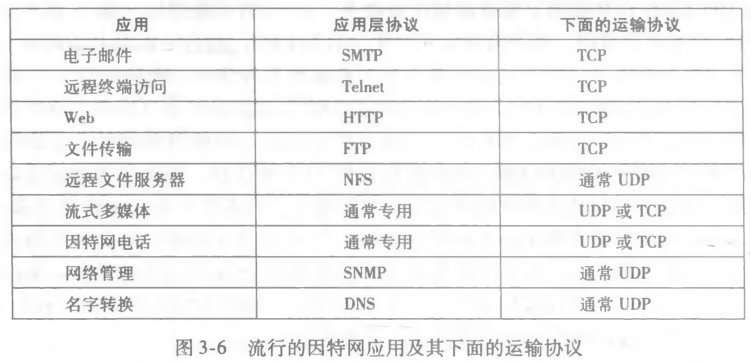

# UDP

## 什么时候该用 UDP 而不是 TCP?

- 对数据进行精细控制: 应用自己决定什么时候发、发多少、丢了怎么办，运输层不替它做决定;
- 无需连接建立: 没有握手，第一个报文段就可以直接带数据，省掉建立连接的一轮往返时延;
- 无状态连接: 协议不维护连接状态，服务器不必为每个客户端保存上下文;
- 分组首部开销小: 首部字段少，留给应用数据的空间相对更多;
- 代价: 换来的是不可靠数据服务，数据可能丢失或乱序，只能由应用自己兜住;

## 哪些流行应用跑在 UDP 上?

- 对应关系: 流行的因特网应用及其运输协议;

## UDP 报文段长什么样?

- 标准来源: 由 RFC 768 定义;
- 首部字段: 源端口号 + 目标端口号 + 报文段长度 + 检验和，共四项;
- 数据字段: 应用层报文;
- 开销: 首部只有四个字段，因此分组首部开销小;

## UDP 检验和如何发现比特差错?

- 目的: 用于差错检测功能，让接收方知道报文段在传输中是否被改坏;
- 计算方法: 报文段的所有 16 bit 字的和进行反码运算作为检验和; 记第 `i` 个 16 bit 字为 `w_i`，检验和就是对 `w_1 + w_2 + ... + w_n` 取反码;

- 溢出回卷: 若和溢出，即为 17 bit，需要将第一位 bit 与其后 16 bit 进行相加运算;
- 接收方验证: 将报文段的所有 16 bit 字和检验和进行相加，结果所有比特都为 1 就认为没有差错;
- 能力边界: UDP 只能检查错误，无法修复错误;
