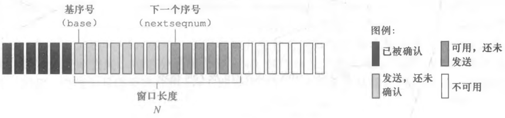
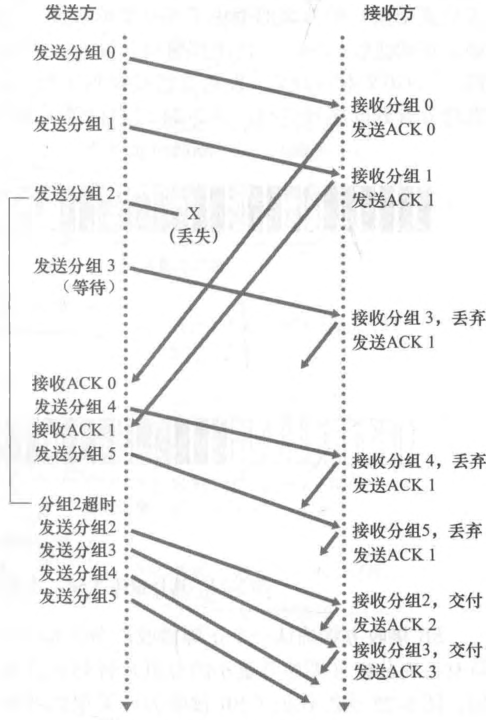
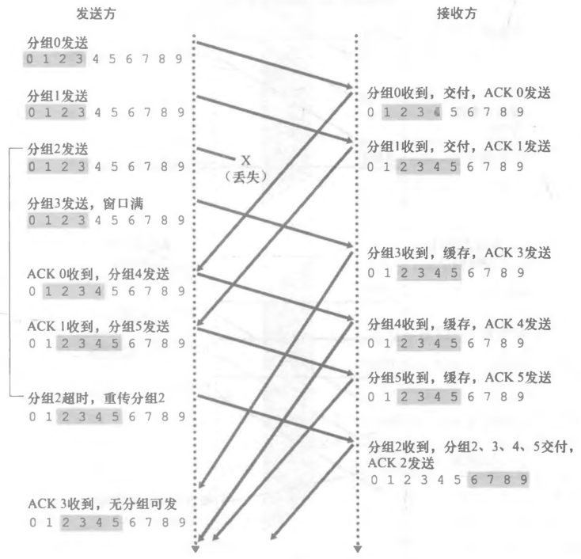

# 丢包与流水线协议

## 丢包时靠什么发现?

- 比特交替协议: 使用 1 bit 标识序号（0 和 1），ACK 序号在 0 和 1 之间来回交替; 只使用 ACK 判断接收方是否接受错误分组;
- 丢包的可能性: 发送方发送的分组丢包，接收方发送的控制报文丢包;
- 检查丢包的机制: 通过定时器检验是否丢包，一旦超过一定时间就判断其为丢包，重新发送该分组;
- 代价: 定时器只能靠"等够久"来猜，等得短了会误判重传，等得长了恢复就慢;

## 停等协议为什么浪费链路?

- 比特交替协议的缺陷: 比特交替协议为停等协议，浪费网络链路性能;
- 原因: 发送方发完一个分组就停下来等确认，往返时延期间链路上没有数据在传;
- 流水线: 不使用停等协议，允许发送方发送多个分组，让链路上同时有多个分组在飞;
- 流水线的要求: 增加序号范围，避免新旧分组序号混淆; 接收方和发送方需要缓存多个分组，确保分组接受或发送成功;
- 发送速度: 流水线的发送速度由拥塞控制决定;

## 回退 N 步如何处理失序分组?

- 回退 N 步协议（GBN）发送方: 允许发送方发送多个分组，要求流水线中确定一个长度为 `N` 的窗口;
- 发送方定时器: 发送方只有最左侧分组具有一个定时器，一旦出现超时，重传窗口中已经发送但是还未确定的分组;
- 发送方滑动: 窗口随着最左边分组的确定不断向右边滑动;
- 接收方: 接收方接受到失序分组直接丢弃，等待窗口全部接受完毕;
- 代价: 一个分组丢失会让窗口内后面已经正确到达的分组白传一遍;

## 选择重传为什么比回退 N 步更省重传?

- 选择重传（SR）发送方: 允许发送方发送多个分组，要求流水线中确定一个长度为 `N` 的窗口; 依次发送窗口内所有分组直至所有分组发送完毕，等待 ACK;
- 发送方定时器: 发送方每个分组具有一个定时器，一旦出现超时，重传超时的对应分组;
- 发送方滑动: 窗口随着最左侧分组的确定不断向右边滑动;
- 接收方: 接收方缓存多个分组，要求流水线中确定一个长度为 `N` 的窗口; 窗口随着最左侧分组的确定不断向右边滑动;
- 接收方缓存规则: 窗口非最左侧的分组正确接受后，缓存该分组;
- 代价: 每个分组都要维护定时器和缓存，发送方与接收方的状态都比 GBN 复杂;

