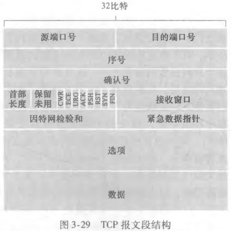

# TCP 连接管理与握手

## 为什么 TCP 在传数据之前必须先握手?

- 面向连接: 两个进程发送数据之前必须互相握手，确定数据传输的参数;
- 握手的作用: 双方在正式传输前就序号、窗口等参数达成一致，之后的数据都挂在这条连接上;
- 代价: 多了一轮往返时延，建立连接期间基本不能传应用数据（第三次握手除外）;

## 缓存和报文段长度在什么时候确定?

- 发送缓存和接收缓存: 在三次握手期间设置;
- 发送缓存: TCP 通过套接字接受数据保存至发送缓存，TCP 不定时从发送缓存取出一块数据发送至网络层;
- 接收缓存: TCP 接受网络层的数据保存到接收缓存，TCP 通过套接字将接受缓存的数据发送至进程;
- MSS（最大报文段长度）: TCP 报文段中数据部分的上限;
- MTU（最大传输单元）: 最大链路层帧长度;
- 经典值: MSS 为 1460 byte，MTU 为 1460 + 40（TCP/IP 首部长度）byte;

## TCP 报文段由哪些字段组成?

- 首部字段: 源端口号字段、目标端口号字段、检验和字段、序号字段、接收窗口字段（流量控制）、首部长度字段、选项字段、标志字段;
- 数据字段: 应用层报文;

## 序号和确认号如何标识字节流?

- 序号（Seq）: TCP 第一次报文的序号字段为该报文段首字节的字节流编号，以后为另一方最新发送报文的 ACK 号;
- 起始序号: 双方的起始序号不一定相同，因此一条连接的两个方向各有一套编号;
- 确认号（ACK）: 接受主机预期接受的字节流序号，即字节流中第一个未被确认的字节的序号; 也是另一方发送的 Seq + 1;
- 累计确认: 确认号对"它之前的所有字节都收到了"做一次性确认，不必逐段确认;

## 报文段失序到达时接收方怎么做?

- RFC 未规定: 接受到失序报文段后接收方该怎么做，RFC 并没有规定;
- 可选做法: 可采用回退 N 步或选择重传;
- 实际选择: 一般使用选择重传，先缓存失序报文段，等缺失的部分补齐;

