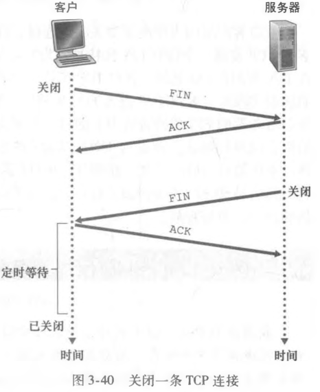
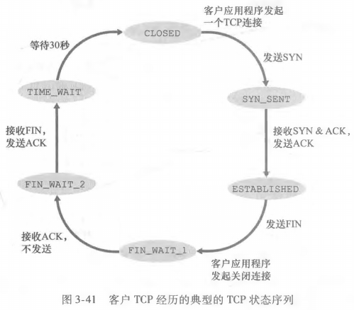
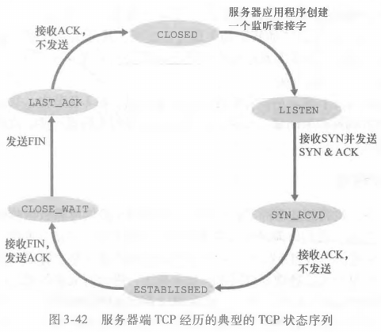

# TCP 状态机与 SYN 洪泛

## 三次握手每一步各完成了什么?

- 第一次握手: 客户端向服务器端发送一个 TCP 报文段，称作 SYN 报文段; 首部 SYN 标志设置为 1，设置客户端初始序号 `client_isn`; 该报文段不包含应用层数据;
- 第二次握手: 服务器接受客户端发送的 SYN 报文段，为该 TCP 连接分配 TCP 缓存和变量，向客户端发送允许连接的 SYNACK 报文段; 首部 SYN 标志设置为 1，设置 ACK 字段为 `client_isn + 1`，设置服务器初始序号 `server_isn`; 该报文段不包含应用层数据;
- 第三次握手: 客户端接受 SYNACK 报文段，为该 TCP 连接分配 TCP 缓存和变量，向服务器发送确认报文段; 首部 SYN 标志设置为 0，设置 ACK 字段为 `server_isn + 1`; 该报文段可以包含应用层数据;

## 三次握手为什么能确认双方的能力?

| 握手   | 确认了什么                                   |
| ------ | -------------------------------------------- |
| 第一次 | 服务器知道客户端发送、服务器接受能力正常     |
| 第二次 | 客户端知道客户端和服务器的发送和接受能力正常 |
| 第三次 | 服务器知道客户端接受能力正常                 |

## 关闭连接为什么要四次握手?

- 第一次握手: 主动关闭方进行第一次握手，通常为客户端; 客户端向服务器发送一个特殊 TCP 报文段，设置客户端初始序号 `client_isn`，FIN 设置为 1;
- 第二次握手: 服务器接受该报文段后发送一个确认报文段，ACK 为 `client_isn + 1`;
- 第三次握手: 服务器处理完当前所有数据后，发送自己的终止报文段，FIN 设置为 1，设置服务器随机序号 `server_isn`;
- 第四次握手: 客户端接受服务器发送的终止报文段，发送一个确认报文段，ACK 为 `server_isn + 1`;
- 原因: 确保双方正确关闭连接并处理完所有数据; 第三次握手时被关闭一方可能具有未处理完成的数据，需要等待数据处理完成再发送 FIN 报文;

## 连接的每个状态代表什么?

| 客户端事件                                        | 状态        |
| ------------------------------------------------- | ----------- |
| 发送 SYN 报文                                     | SYN_SENT    |
| 接受 SYN ACK 报文，并发送 ACK 报文，建立 TCP 连接 | ESTABLISHED |
| 关闭 TCP 连接，发送 FIN 报文                      | FIN_WAIT_1  |
| 接受服务器 ACK 报文                               | FIN_WAIT_2  |
| 接受服务器 FIN 报文，发送客户端 ACK 报文          | TIME_WAIT   |
| 等待若干时间，关闭连接                            | CLOSE       |

| 服务器事件                               | 状态        |
| ---------------------------------------- | ----------- |
| 创建 TCP                                 | LISTEN      |
| 接受客户端 SYN 报文，并发送 ACK 报文     | SYN_RCVD    |
| 接受客户端 ACK 报文，建立 TCP 连接       | ESTABLISHED |
| 接受客户端 FIN 报文，发送服务器 ACK 报文 | CLOSE_WAIT  |
| 发送服务器 FIN 报文                      | LAST_ACK    |
| 接受客户端 ACK 报文，关闭 TCP 连接       | CLOSE       |

## SYN 洪泛攻击如何拖垮服务器?

- 半开连接: 服务器发送 SYNACK 报文后需要等待客户端的确认，期间服务器需要维持一个半开连接;
- 攻击方式: 攻击者发送大量 SYN 报文段但不确认服务器发送的 SYNACK 报文，服务器维护大量半开连接导致资源消耗殆尽;
- SYN cookie: 服务器接受到 SYN 报文后不生成一个半开连接，而是基于 SYN 报文的 IP 地址和端口号生成一个 TCP 序列号，即 `server_isn`;
- 生效条件: 服务器接受到客户端发送的合法 ACK 报文后，才会生成一个全开连接;
