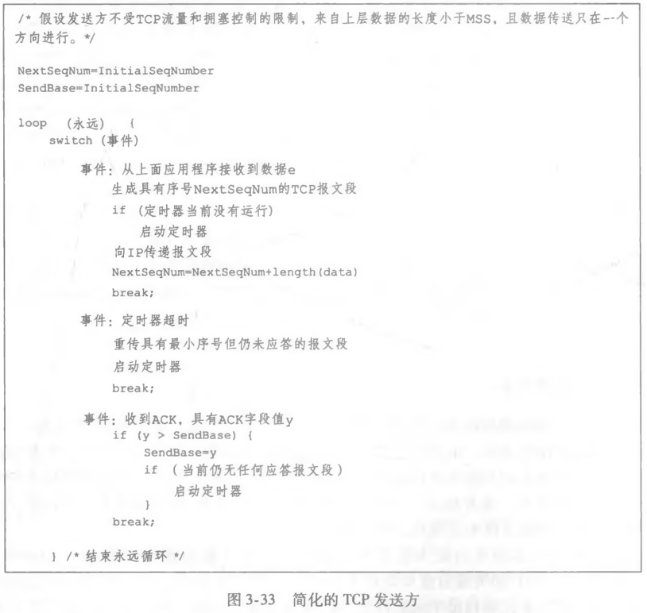

# TCP 可靠传输与缺陷

## 为什么 TCP 只用一个重传定时器?

- 单一重传定时器: RFC 6298 推荐使用单一的重传定时器;
- 记录范围: 仅记录一个最小序号的发送但未被确认的报文段;
- 代价: 省掉了为每个报文段维护定时器的开销，但多个报文段共用一个定时器，超时后只能从最小未确认序号开始重传;

## 发送方要响应哪些事件?

- 三个事件: 接收应用层数据、定时器超时、接受 ACK;
- `NextSeqNum`: 报文段首字节的字节流编号;
- `SendBase`: 字节流中第一个发送但未被确认的字节的序号;
- 差错检验: 接收方通过检验和判断报文段是否被改坏;

## 什么情况下会提前重传?

- 超时间隔加倍: 每次 TCP 重传时，并不使用计算的超时间隔，而是每超时一次便将超时间隔加倍;
- 动机: 连续超时说明网络比估计的更糟，退避可以少发一些无用重传;
- 快速重传: TCP 接收方大量发送冗余 ACK;
- 冗余 ACK 的发送机制: 所期望的报文到达，发送对应 ACK 记作 `a`; 失序报文段到达，立刻发送冗余 ACK `a`;
- 触发条件: 发送方一旦接受 3 个冗余 ACK，立刻重传该报文段，不必等定时器超时;

## TCP 到底像回退 N 步还是选择重传?

- 像 GBN 的地方: TCP 发送方使用单一计时器，只记录发送过但未确认的最小序号;
- 像 SR 的地方: TCP 发送方至多重传一个报文段，即发送但未确认的最小序号; TCP 接收方使用一个窗口记录失序报文段;
- 结论: TCP 类似于 GBN 和 SR 的混合体;

## 字节流为什么会粘包?

- 原因: TCP 基于字节流发送，发送数据可能一次性发送，也可能分包发送; 接收端无法辨别接受数据属于哪个消息;
- 长度控制: 设置消息长度，根据长度读取报文;
- 特殊字符: 消息末尾设置特殊字符，根据特殊字符辨别消息;
- 消息头: 添加特殊标记，根据特殊标记辨别消息;

## 队首堵塞和抖动从何而来?

- 队首堵塞（HOL）: TCP 使用滑动窗口实现流水线协议，滑动窗口队首字节的丢失会堵塞滑动窗口的移动，称为队首堵塞;
- 不可见性: HOL 作用于运输层，应用程序对此一无所知;
- 抖动: 由于分组到达时间未知，应用程序通过套接字读取数据具有不可预知延迟，称为抖动;
