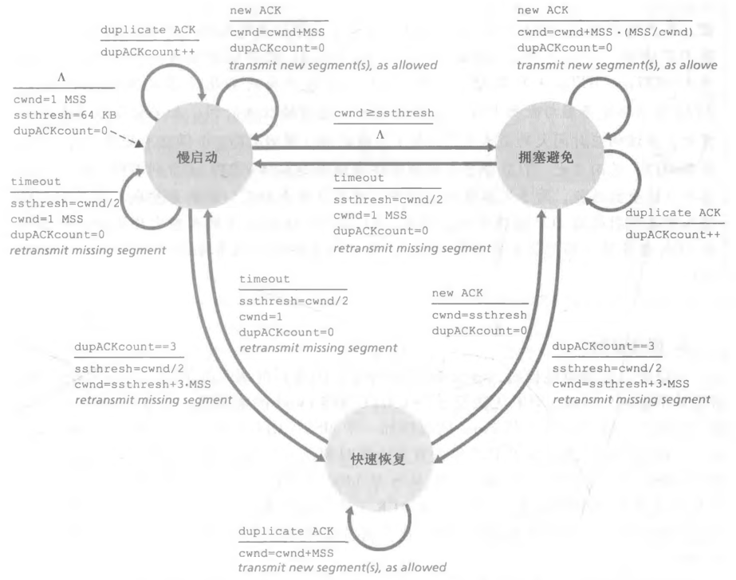

# 慢启动与拥塞避免

## 慢启动"慢"在哪里?

- 起始值: `cwnd` 初始值为 MSS;
- 增长方式: 每经过一个 RTT 发送速率翻倍，即每接受一个报文 `cwnd += MSS`;
- 名字与实质: `cwnd` 从一个 MSS 起步，看起来慢; 但每经过一个 RTT 就翻一倍，很快就能涨起来;

## 慢启动什么时候停下来?

| 触发条件                                 | 动作                                                                    |
| ---------------------------------------- | ----------------------------------------------------------------------- |
| 发生超时事件                             | `cwnd` 重置为 MSS，设置 `ssthresh` 为发生拥塞时的 `cwnd/2`，重新慢启动  |
| `ssthresh` 存在且 `cwnd` 达到 `ssthresh` | 进入拥塞避免模式                                                        |
| 接受到 3 个冗余 ACK                      | 执行快速重传并进入快速恢复状态，设置 `ssthresh` 为发生拥塞时的 `cwnd/2` |

## 拥塞避免如何缓慢增长?

- 增长方式: 进入拥塞避免状态后，每经过一个 RTT 发送速率增加一个 MSS，即每接受一个报文 `cwnd += MSS*(MSS/cwnd)`;
- 效果: 每个 RTT 只增加一个报文段，比慢启动的翻倍增长慢得多;
- 停止机制: 和慢启动相同;

## 快速恢复快在哪?

- 进入时: `cwnd` 设置为 `ssthresh + 3*MSS`;
- 增长: 每收到一个 ACK 增加一个 MSS;
- 退出: 接受到缺失报文的 ACK 后进入拥塞避免状态，`cwnd` 设置为 `ssthresh`;
- 出现丢包事件: 处理方式同慢启动;

## 路由器如何直接告诉发送方拥塞?

- 明确拥塞通告（ECN）: IP 数据报首部设置 ECN 字段表示拥塞信息;
- 作用: 属于网络辅助的拥塞控制，把拥塞状态写进分组，让发送方拿到网络的直接反馈;
