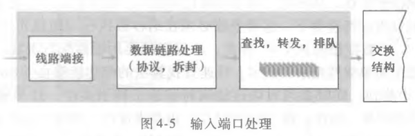
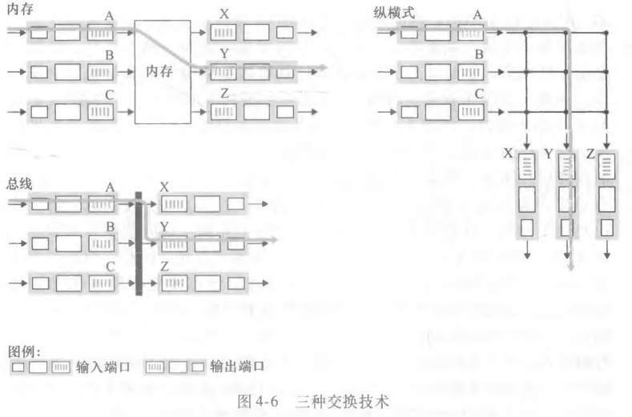
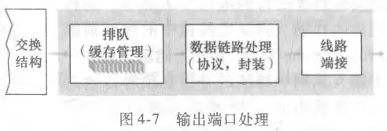

# 路由器体系结构与分组调度

## 路由器的硬件和软件各做什么?

- 数据平面: 硬件实现; 由输入端口、交换结构、输出端口组成;
- 控制平面: 软件实现; 由路由选择处理器组成;
- 为什么这样分: 数据平面要在纳秒级处理每个分组，只能用硬件; 控制平面算得少但逻辑复杂，用软件更灵活;

## 分组进入输入端口后要经过哪些步骤?

- 输入端口处理四步: 线路端接; 数据链路处理; 查找, 转发, 排队; 进入交换结构;
- 线路端接与数据链路处理: 把物理信号变成帧、剥掉链路层首部，得到网络层数据报;
- 查找与转发: 用数据报首部字段查转发表，决定这个分组该从哪个输出端口出去; 暂时出不去就进入排队;

## 多个前缀都能匹配时该选哪个?

- 最长前缀匹配（longest prefix matching）: 路由器在转发表中寻找最长的匹配项，并向对应链路接口转发分组;
- 为什么这样定: 前缀越长，覆盖的地址范围越小、越具体; 选最长的匹配项等于选最精确的那条路由;

## 交换结构用哪三种技术把分组搬到输出端口?

- 经内存交换: 使用内存交换分组; 同一时间内仅能执行一次读或写;
- 经总线交换: 多个输入端口和输出端口共享一条总线; 同一时间只能一个分组使用总线;
- 经互联网络交换: 使用一条 2N 条总线构成的互联网络; 连接 N 个输入和输出端口;
- 能力差异: 内存交换受内存带宽限制，总线交换受总线带宽限制，互联网络交换允许多对端口同时交换;

## 分组离开交换结构后要经过哪些步骤?

- 输出端口处理四步: 离开交换结构; 排队; 数据链路处理; 线路端接;
- 与输入端口的对称性: 输出端口把数据报重新封装成帧、再变成物理信号发出去，中间多了一次排队;
- 排队的来源: 交换结构送来的分组速率可能超过输出链路的发送速率，多出来的只能先缓存;

## 分组为什么会在路由器里丢包?

- 丢包（packet loss）: 路由器缓存空间耗尽，分组被路由器丢弃;
- 输入排队: 线路前部堵塞（HOL 堵塞）; 输入队列排队的分组必须等待队列前面的分组交换完毕;
- HOL 的代价: 队首分组挡住去路时，后面本可以立即交换的分组也被迫等待，输入链路的利用率被拉低;
- 输出排队: 主动队列管理（AQM）; 缓存空间耗尽时，基于 AQM 算法丢弃到达的分组或一个排队中的分组;
- AQM 的动机: 缓存迟早会满，与其等满了再被迫丢包，不如提前按规则丢，让发送方更早感知到拥塞;

## 队列里的分组按什么顺序被发送?

- 先进先出（FIFO）: 根据分组到达顺序依次处理;
- 优先权排队: 根据数据报的首部信息设置优先级; 不同优先级具有不同的等待队列; 优先选择优先级高的分组; 相同优先级内使用 FIFO;
- 非抢占式优先权排队: 分组一旦传输就不能被中断，即使优先级更高的分组到达;
- 循环排队规则: 不存在严格的优先级; 循环调度器在若干等待队列中循环选择;
- 加权公平排队（WFQ）: 不存在严格的优先级; 每个队列具有一个基于分组数量的加权平均值; 每个队列至少可以分配到对应加权平均值的带宽;
- 取舍: 优先权排队照顾重要业务但可能饿死低优先级队列，循环排队和 WFQ 用轮转保证各队列都能分到带宽;
