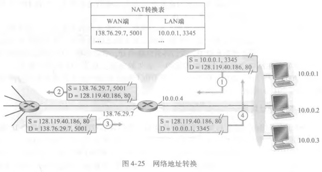
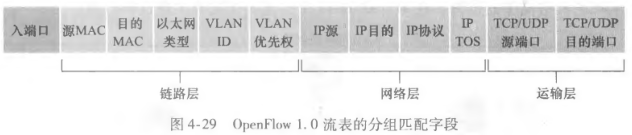

# NAT 与 IPv6

## NAT 为什么能让多台内网主机共用一个公网地址?

- 专用地址: IPv4 保留一部分地址空间用于专用网络; 这些地址只在内部使用，外界不会路由它们;
- NAT（网络地址转换）: 使用 NAT 进行外界 IP 地址和专用网络 IP 地址的转换;
- 单射机制: NAT 使用 IP 地址和端口进行单射; 靠端口区分内网的不同主机，一个公网地址因此能对应多台内网主机;
- 容量上限: 最多支持 65535 个内网主机共享一个 IP; 可用的端口只有这么多，超出就无法区分;
- 对外表现: 专用网络中的主机具有唯一的专用网络 IP 地址，共享一个外界 IP 地址; 从外网看，流量都像是那一台设备发出的;

## NAT 带来了哪些好处和代价?

- 优点一: 节省 IP 地址; 一个公网地址能给一整片内网使用;
- 优点二: 内网主机可通过 NAT 访问外网 IP; 内网主机不必每人一个公网地址;
- 优点三: 隐藏内网主机 IP 地址，形成简单的安全保护; 外网无法直接看到内网结构;
- 优点四: 可以做负载均衡;
- 缺点一: 网络延迟增大; 每个分组都要改写地址和端口;
- 缺点二: 无法进行端到端的 IP 追踪; 中间隔了一层转换，来源变得不透明;
- 缺点三: 部分应用层协议无法识别，如 ftp、udp; 协议报文里内嵌地址时，NAT 改不了;
- 权衡: 省地址和隐藏内网是主要收益，代价是破坏了端到端的透明性;

## 中间盒是什么?

- 中间盒（middlebox）: 执行 NAT、负载均衡、流量防火墙（IDS）等功能的一个中间组件;
- 位置: 它不在通信两端，而在路径中间对流量做额外处理;
- 代价: 中间盒越多，端到端的假设越不成立，协议设计必须考虑它们的干扰;

## IPv6 的数据报和编址有什么不同?

- 首部字段: IPv6 的数据报同样由首部字段和数据字段组成;
- 数据字段: TCP 或 UDP 报文段;
- 128 bit 编址: IPv6 地址长度是 128 位; 地址空间远大于 IPv4，缓解地址耗尽;

## IPv6 和 IPv4 的差别在哪里?

- 分片: IPv6 不支持在中间路由器进行数据报的分片和组装; 中间路由器遇到过大的数据报只能丢弃并通知发送方;
- 检验和: IPv6 无首部检验和字段; 网络层不再重复做链路层和运输层已经做过的校验;

## IPv6 怎么在 IPv4 的世界里跑起来?

- 迁移难题: 网络设备不可能一夜之间全部换成 IPv6，只能边用边过渡;
- 建隧道（tunneling）: 使用一个 IPv4 中间路由器进行中转;
- 做法: 将 IPv6 数据报放到 IPv4 数据报的数据字段中; 对中间的 IPv4 路由器来说，它只是一份普通的 IPv4 数据报;

## 通用转发为什么比基于目的地转发更灵活?

- 通用转发: 匹配加动作;
- 匹配: 匹配首部字段; 可以同时看多个字段，而不只是目的地址;
- 动作: 匹配后进行的操作，如转发、负载均衡;
- 与基于目的地转发的区别: 基于目的地转发只按目的地址查表，通用转发让"匹配什么"和"匹配后做什么"都可以编程;

## OpenFlow 的流表和动作有哪些?

- OpenFlow: 通用转发的标准;
- 流表: OpenFlow 中的匹配加动作转发表，包含三项内容;
- 首部字段集合: 用来和进入的分组做匹配;
- 计数器集合: 记录匹配到该流表项的分组数量等统计;
- 动作集合: 匹配成功后要执行的操作;
- 匹配字段举例: 入端口为分组交换机接收分组的输入端口;
- 三种动作: 转发; 丢弃; 修改字段;

