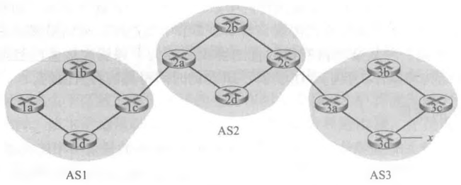

# 自治系统与 BGP

## 为什么要划分自治系统?

- 自治系统（AS）: 由处于相同控制下的路由器组成，使用相同的路由选择算法; 它把一大片网络当作一个整体来管理;
- 对外隐藏内部: AS 对外部隐藏内部网络信息，对内使用自己的路由选择算法; 外部只需要知道"去哪些前缀要经过这个 AS";
- 一个 ISP 有多个 AS: 一个 ISP 具有一个或多个 AS; 规模越大，越可能拆成多个 AS 分别管理;
- 层级划分: 基于 ISP 的层级结构，AS 层层划分; 每一层只管自己这一层的事;
- AS 号: 自治系统具有唯一的 AS 号; 它是这个 AS 在外部世界里的身份标识;
- 内部路由选择协议: 在 AS 运行的路由选择算法叫做自治系统内部路由选择协议;

## 自治系统内部用什么协议?

- OSPF（开放最短路优先）: 一种自治系统内部路由选择协议;
- 链路状态协议: OSPF 使用泛洪链路状态信息和 Dijkstra 算法;
- 链路开销人工设置: 开销不由实时负载决定，而是人为配置; 因此不会出现负载敏感算法那样的震荡;
- 广播时机: 自治系统内的路由器链路状态发生变化即实时广播链路状态信息，反之周期性广播;
- 与 AS 的关系: OSPF 只在一个 AS 内部工作，负责让 AS 内的路由器对拓扑达成一致;

## OSPF 有哪些优点?

- 安全: OSPF 报文可以被鉴别，避免伪造的路由信息;
- 多条等价路径: 允许使用多条相同开销的路径; 流量可以分摊，而不是只走一条;
- 多播与单播: 多播 OSPF（MOSPF）和单播的综合支持;
- 层次结构: 支持在单个 AS 中的层次结构; 大 AS 可以再分区管理;

## 不同自治系统之间靠什么交换路由信息?

- 自治系统间路由选择协议: 所有 AS 使用同一路由选择协议; 称作边界网关协议（BGP）;
- 作用一: 从相邻 AS 中获得 IP 前缀的可达性信息;
- 作用二: 确定到某 IP 前缀的最好路由;
- 为什么需要统一协议: AS 之间必须能互相理解对方的通告，否则各自为政就无法拼成一张全球网络;

## 网关路由器和内部路由器分别是什么?

- 网关路由器（gateway router）: 位于 AS 边缘的路由器; 与其他 AS 的网关路由器进行连接;
- 内部路由器（internal router）: 仅连接 AS 内部的主机和路由器;
- 分工: 跨 AS 的流量必须经过网关路由器，内部路由器只负责把流量送到本 AS 的出口;

## iBGP 和 eBGP 有什么区别?

- 运输方式: 使用 TCP 协议和 179 端口发送 BGP 报文;
- 内部 BGP 连接（iBGP）: 同一 AS 的 BGP 连接称作内部 BGP 连接;
- 外部 BGP 连接（eBGP）: 跨越 AS 的 BGP 连接称作外部 BGP 连接;
- 用途差别: eBGP 用来和邻居 AS 交换前缀可达性，iBGP 用来把学到的外部路由在 AS 内部传播;

## IP 任播是怎样把请求送到最近服务器的?

- IP 任播（anycast）: BGP 用于 IP 任播协议;
- 机制: 将请求通过 BGP 路由到最近的服务器;
- 收益: 多个地点宣告同一地址，用户自然被路由到拓扑上最近的那一台，省去额外的调度;

## SDN 控制平面有哪些关键特征?

- 基于流的转发: 转发决策按"流"来做，而不是逐分组只看目的地址;
- 数据平面与控制平面分离: 转发设备只负责转发，决策交给外部控制器;
- 网络控制功能: 控制逻辑集中在一处，能拿到全网视图;
- 可编程的网络: 控制程序可以自己写，网络行为随之改变;
- OpenFlow 协议: 控制器与设备之间用 OpenFlow 协议通信;

## SDN 控制器由哪几层组成?

- 组成部分: SDN 控制平面由 SDN 控制器和 SDN 网络控制应用程序两部分组成;
- 通信层: SDN 控制器和受控网络设备的通信;
- 网络范围状态管理层: 保存受控网络设备的状态信息;
- 接口层: 对于网络控制应用程序层的接口;
- 分层的意义: 底层只管和设备说话，中层维护全网状态，上层给应用提供编程入口，各层职责互不重叠;

