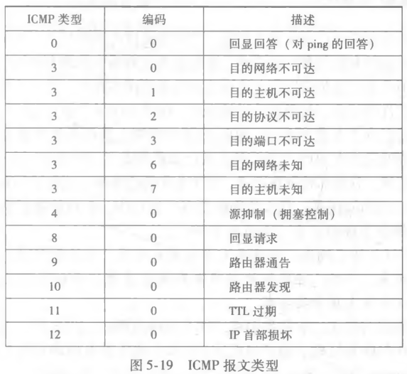

# ICMP 与网络管理

## ICMP 在哪里、做什么?

- ICMP（因特网控制报文协议）: 用于主机和路由器之间对网络层信息的通信; 它不搬运应用数据，而是报告网络层的状况;
- 位置: ICMP 报文位于 IP 数据报的数据字段中; 也就是说 ICMP 本身是 IP 的载荷，跟着数据报一起被转发;
- 为什么需要它: IP 只管尽力而为地转发，出错时没人负责通知发送方，ICMP 补上这个"回话"的机制;

## TTL 和 ICMP 有什么关系?

- TTL 的位置: TTL 是 IP 数据报的首部字段;
- 含义: 表示 ICMP 允许的最大转发次数; 每经过一个路由器减一，减到零该数据报就被丢弃;
- 为什么需要: 没有跳数上限，路由出现环路时数据报会永远在网络里打转;

## ICMP 报文有哪些类型?

- 类型的作用: 接收方靠报文类型判断这条 ICMP 报文在报告哪一类网络层事件;

## 网络管理框架由哪五个要素组成?

- 管理服务器: 运行管理程序、发出管理指令的一方;
- 被管设备: 被管理的网络设备;
- 管理信息库（MIB）: 存放被管设备状态信息的库;
- 网络管理代理: 运行在被管设备上的一个进程; 与管理服务器通信;
- 网络管理协议: 允许管理服务器通过网络管理协议查询被管设备状态，并通过代理采取行动;
- 分工: 服务器负责决策，代理负责执行，MIB 负责存状态，协议负责把三者连起来;

## SNMP 怎样在管理服务器和代理之间通信?

- SNMP（简单网络管理协议）: 用于在管理服务器和网络管理代理之间传递网络管理控制和报文;
- 请求响应模式: 管理服务器发送请求; 代理响应请求并执行动作;
- 非请求报文（陷阱报文）: 代理向管理服务器通知异常情况; 不用等服务器来问，设备自己先报;
- 两种模式的分工: 请求响应用于主动查询和配置，陷阱报文用于被动上报突发事件;
