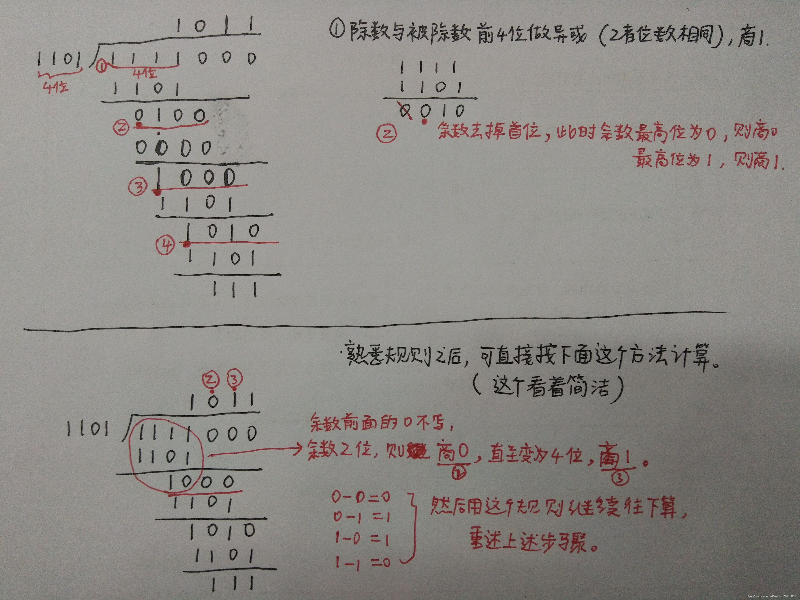

# 差错检测与纠错

## 差错检测为什么要付出冗余比特的代价?

- 差错检测: 发送方在数据之外附加冗余比特，接收方靠这些冗余比特判断数据在传输中是否被破坏;
- 动机: 链路上的信号可能被噪声翻转，接收方必须有能力发现"收到的不是发出去的";
- 代价: 冗余比特本身也占用链路容量，冗余越多检错能力越强，能带的净数据越少;

## 一个奇偶比特能发现什么错?

- 奇偶校验（parity check）: 额外附加一个比特，使得 `d` + 1 个比特中 1 的总数为偶数;
- 能发现的错: 只有奇数个比特被翻转时，1 的个数的奇偶性才会改变，因此它只能发现奇数个比特出错;
- 漏掉的错: 两个比特同时翻转时 1 的个数不变，差错就被放过;

## 二维奇偶校验多了什么能力?

- 二维奇偶校验: 将 `d` 个比特划分为 `i` 行 `j` 列，通过 `i` + `j` + 1 个奇偶比特进行差错检测;
- 能力提升: 行和列的校验会同时失败，出错比特的位置因此可以被定位，于是不仅能检测，还能纠正单个比特差错;
- 代价: 冗余比特从一个增加到 `i` + `j` + 1 个;

## 前向纠错解决了什么麻烦?

- 前向纠错（FEC, Forward Error Correction）: 由接收方检测和纠正差错;
- 动机: 只能检测时，出错的帧得等发送方重传，一来一回的等待很贵; FEC 把纠错能力放在接收方，省掉这次往返;
- 代价: 纠正比单纯检测需要更多冗余比特;

## 检验和是怎样算出来的?

- 检验和方法: 将帧中的所有 16 bit 数据进行求和，和的反码作为检验和;
- 接收方的验证: 接收方对检验和和数据字节求和，根据结果是否全为 1 比特判断是否出现差错;
- 特点: 计算简单，但对某些差错的检出能力弱于 CRC;

## CRC 靠什么模式判断帧有没有出错?

- 循环冗余检测编码（CRC）: 又称多项式编码;
- 生成多项式: 发送方和接收方协商一个 `r` + 1 比特模式，称作生成多项式，简写为 `G`;
- 发送方的做法: 对于一个 `d` 比特的数据字段 `D`，发送方选择 `r` 个附加比特附加至 `D`，使 `d` + `r` 比特模式可以被 `G` 使用模 2 算术整除;
- 接收方的做法: 接收方使用 `G` 与 `d` + `r` 比特进行模 2 算术整除，通过检测余数是否为 0 进行差错检测;
- 代价: 要多发 `r` 个比特，换来比奇偶校验强得多的检错能力;

## 模 2 运算为什么就是异或?

- 模 2 整除: 每一位结果不影响其他位;
- 本质: 模 2 运算实则就是求异或（XOR）;
- 判错依据: 模 2 除法得到的余数是否为 0，就是接收方判断有没有差错的依据;

