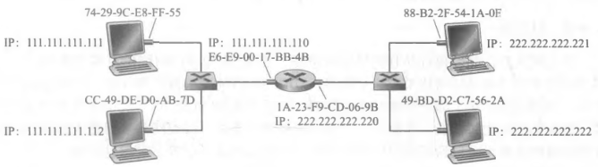
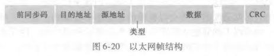

# ARP 与以太网

## 链路层用什么地址标识接口?

- MAC 地址: 主机和路由器网络接口的链路层地址; 长 6 字节，使用 16 进制表示;
- 广播 MAC 地址: `FF-FF-FF-FF-FF-FF`，发给所有接口的地址;
- 为什么还要 MAC 地址: 网络层的 IP 地址管"发给哪台主机"，链路层的 MAC 地址管"这一跳把帧交给哪个接口"，两者是不同层的地址;

## ARP 如何把 IP 地址换成 MAC 地址?

- 地址解析协议（ARP）: 用于 IP 地址和 MAC 地址的转换;
- 作用范围: ARP 只为同一个子网的主机和路由器解析 IP 地址; 出了子网就不归它管;
- ARP 表: 路由器和主机具有一个 ARP 表;
- 未知地址怎么办: 对于未知的 MAC 地址，使用 MAC 广播地址向其他主机和路由器发送 ARP 查询分组并更新 ARP 表;
- ARP 分组的内容: 包括源地址 MAC、源 IP 和目标地址 IP;
- 报文的帧类型: 查询 ARP 报文使用广播帧，响应 ARP 报文使用标准帧;
- 所属层次: ARP 是跨越链路层和网络层的协议;

## 数据发到子网外要经过哪些步骤?

- 中转设备: 使用一台网关路由器进行中转;
- 第一步: 子网 1 内主机使用 ARP 获得网关路由器 MAC 地址;
- 第二步: 子网 1 内主机向网关路由器发送帧;
- 第三步: 网关路由器使用 ARP 获得子网 2 主机 MAC 地址;
- 第四步: 网关路由器向子网 2 内主机发送帧;
- 两次 ARP: 源主机和网关路由器各做一次 ARP，每次解析的都是自己所在子网内的 MAC 地址;

## 以太网用什么拓扑把主机连起来?

- 拓扑结构: 星型拓扑;
- 中心设备: 位于中心的主机称作交换器;

## 以太网帧由哪几部分组成?

- 数据字段: MTU 为 1500 字节;
- 目标地址: MAC 地址;
- 源地址: MAC 地址;
- 类型字段: 用于标识数据字段承载的上层协议;
- CRC: 用于差错检测;
- 前同步码: 唤醒目标适配器;

## 以太网提供什么样的服务?

- 无连接服务: 以太网为网络层提供无连接服务，发送帧之前不需要先建立连接;
- 不可靠服务: 以太网不保证帧被正确收到，它不知道其传输的数据报是一个全新的数据报还是重传的数据报;
- 含义: 帧可能丢失或出错，以太网不为此提供保证;
