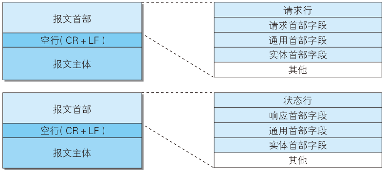
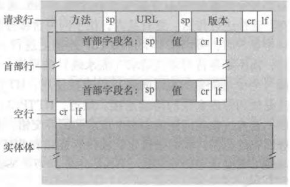

# Web 与 HTTP 基础

## Web 是由哪三样技术撑起来的?

- HTML: 网页文本标记语言，负责描述页面里有什么内容;
- HTTP（HyperText Transfer Protocol，超文本传输协议）: 负责把页面资源从服务器搬到客户端;
- URL（Uniform Resource Locator，统一资源定位符）: 负责指明要取的是哪一个资源;
- 三者分工: HTML 说"页面是什么"，HTTP 说"怎么取"，URL 说"取哪个"; 缺任何一样，浏览器都拼不出一张网页;

## URI 和 URL 是什么关系?

- URI（Uniform Resource Identifier，统一资源标识符）: 表示某个协议方案所表示的资源的定位标识符;
- URI 的写法: 协议方案名接具体标识，例如 `ftp://ftp.is.co.za/rfc/rfc1808.txt`、`http://www.ietf.org/rfc/rfc2396.txt`、`mailto:John.Doe@example.com`、`tel:+1-816-555-1212`; 它不限于 HTTP，还有 `ldap://[2001:db8::7]/c=GB?objectClass?one`、`news:comp.infosystems.www.servers.unix`、`telnet://192.0.2.16:80/`、`urn:oasis:names:specification:docbook:dtd:xml:4.1.2`;
- URI 与 URL 的关系: URL 是 URI 在 HTTP 协议下的子集; 所有 URL 都是 URI，而 URI 的范围更宽;

## HTTP 依赖哪些协议?

- IP（Internet Protocol，网际协议）: 负责不同主机之间的通信;
- TCP（Transmission Control Protocol，传输控制协议）: 负责不同进程之间的通信;
- DNS（Domain Name System，域名系统）: 负责把 URL 解析成 IP 地址;
- 分工: IP 管送到哪台机器，TCP 管送到哪个进程，DNS 管名字对应哪台机器; HTTP 站在它们之上，只表达"要哪个资源";

## HTTP 到底是什么?

- HTTP: 超文本传输协议，定义了 Web 客户端向 Web 服务器请求 Web 网页的方式;
- 标准来源: RFC 1945 与 RFC 2616;
- 运输层协议: HTTP 使用 TCP，丢包与重传交给 TCP 负责，它自己只管报文的内容;
- 无状态: HTTP 不保存请求与响应之间的通讯状态，也不保存客户端的任何信息; 好处是服务器端开销更小，代价是服务器无法从 HTTP 本身看出两次请求是否来自同一个客户端;

## 请求报文和响应报文分别是谁发的?

- 请求报文: 客户端发送的报文，用来索取资源或提交数据;
- 响应报文: 服务器端发送的报文，用来把处理结果回给客户端;
- 一次交互: 客户端发一个请求报文，服务器回一个响应报文; 两者结构相同，差别只在首行的写法;

## 一条 HTTP 报文由哪几部分拼成?

- 报文首部: 报文开头的部分，承载这次请求或响应的元信息;
- 首行: 请求报文的首行是请求行，由方法 + URL + 版本组成; 响应报文的首行是状态行，由版本 + 状态码 + 状态码短语组成;
- 首部字段: 首行之后的行，分为通用首部、请求首部、响应首部、实体首部四类;
- 空行: 用 CR + LF 表示，是首部结束的标志; 没有它，接收方就不知道首部在哪里结束;
- 报文主体: 空行之后的内容，承载真正要传的数据; 请求报文里通常只有 POST 这类方法才带主体;



## 请求报文和响应报文长什么样?



```text
POST /mcp/pc/pcsearch HTTP/1.1
Accept-Encoding: gzip, deflate, br
Accept-Language: zh-CN,zh;q=0.9
Connection: keep-alive
Content-Length: 56
Content-Type: application/json
Sec-Fetch-Dest: empty
Sec-Fetch-Mode: cors
Sec-Fetch-Site: same-site
User-Agent: Mozilla/5.0 (Windows NT 10.0; Win64; x64) AppleWebKit/537.36 (KHTML, like Gecko) Chrome/116.0.0.0 Safari/537.36
```


```text
HTTP/1.1 200 OK
Access-Control-Allow-Credentials: true
Access-Control-Allow-Headers: Content-Type
Access-Control-Allow-Methods: POST, GET
Access-Control-Allow-Origin: https://www.baidu.com
Content-Length: 121
Content-Type: application/json; charset=utf-8
Date: Tue, 29 Aug 2023 11:46:39 GMT
Tracecode: 39767229801514423306082907
```

- 读示例: 请求首行是 `方法 + URL + 版本`，响应首行是 `版本 + 状态码 + 短语`，其余行都是首部字段; 请求里出现了 `Content-Length` 与 `Content-Type`，说明请求体里还有数据;
