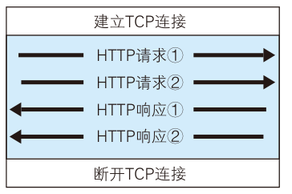

# 持久连接与管线化

## 非持久连接为什么代价高?

- 非持久连接: 一次 HTTP 请求建立并断开一次 TCP 连接; 握手本身不携带业务数据，属于无用的通信开销;
- 连接成本: 不同 http 请求使用单独的 TCP 连接，服务器要为每个请求建立并释放连接，Web 服务器负担重;
- 版本默认: http/1.0 默认为非持久连接，可以用 `Connection: Keep-Alive` 尝试持久连接;

## 请求并接收一个 HTML 要花多长时间?

- 往返时间（RTT, Round-Trip Time）: 一个分组从客户端到服务器再返回客户端花费的时间;
- 第一次握手: 客户端向服务器发送一个小 TCP 报文段;
- 第二次握手: 服务器向客户端发送一个小 TCP 报文段做出确认和响应;
- 第三次握手: 客户端向服务器发送一个小 TCP 报文段返回确认;
- 时间账: 三次握手的前两次花费一个 RTT，第三次握手和服务器传输 HTML 花费了一个 RTT;
- 总时间: 2 个 RTT + 服务器传输 HTML 的时间; 连接建立阶段并不传数据，所以这段等待是纯粹的开销;

## 持久连接如何减少开销?

- 持久连接（HTTP keep-alive）: 任意一端没有断开连接，就保持 TCP 连接状态，后续请求直接复用这条连接;
- 版本默认: HTTP/1.1 以上版本默认为持久连接;
- 关闭方式: 使用 `Connection: Close` 关闭持久连接;
- 同源要求: 要求 HTTP 请求为同源请求，跨源请求不能复用同一条持久连接;
- 空闲回收: TCP 连接一定时间未被使用就会关闭，避免长期占用;

## 管线化和多路复用分别解决什么?

- 管线化: http/1.1 的特性，做到一次发送多个请求;
- 管线化的代价: 依旧要求按发送顺序接受响应请求，前面的响应慢，后面的响应就得等，依旧会发生堵塞现象;
- 多路复用: http/2.0 的特性，并行交错发送多个请求，请求和响应之间互不影响;
- 对比: 管线化只是把请求提前排队发出，多路复用让多个请求真正并行、互不阻塞;

