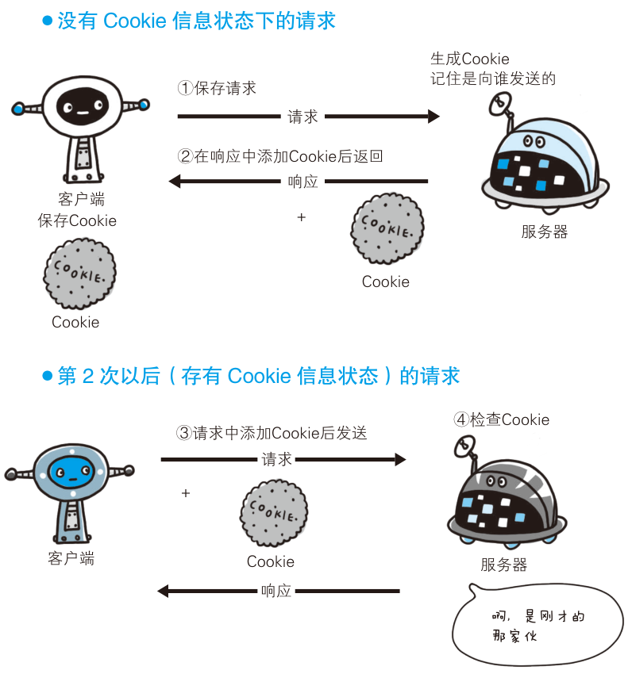

# 状态管理与内容协商

## HTTP 无状态会带来什么问题?

- 无状态带来的缺口: 服务器不保存请求和响应之间的通讯状态，于是认不出两次请求来自同一个人，登录态这类跨请求信息无处存放;
- 好处: 服务器不必为每个客户端保留上下文，减少了服务器端开销;

## cookie 如何把状态补回来?

- cookie 的定位: 存储用户信息，由 RFC 6265 定义，但是具有一定的安全隐患;
- 生成: 服务器端生成 cookie;
- 下发: 响应报文设置 `Set-Cookie` 首部字段，通知客户端使用 cookie 保存状态信息;
- 回传: 下次请求报文自动添加并发送 cookie，服务器据此认出客户端;
- 流程: 第一次请求不带 cookie → 响应中 `Set-Cookie` → 客户端保存 → 后续请求自动携带 `Cookie` → 服务器检查 cookie;

```bash
# 第一次响应下发
Set-Cookie: status=enable; expires=Tue, 05 Jul 2011 07:26:31 GMT; path=/; domain=.hackr.jp;
# 第二次请求自动带上
Cookie: status=enable
```



## 什么情况下 cookie 会被自动携带?

- 条件一 domain: 请求的 domain 与 cookie 的 domain 相同;
- 条件二协议: 协议相同，或者 secure 为 false;
- 条件三路径: 请求 url 和 path 及其子路径一致;
- 跨域携带 cookie: 客户端设置 `"withCredentials": true`，服务器端再配置响应首部，两者缺一不可;

```bash
# 客户端
withCredentials: true
# 服务器端
Access-Control-Allow-Origin: http://xxx:${port}
Access-Control-Allow-Credentials: true
```

## 服务器如何为客户端挑出最合适的资源?

- 内容协商: 服务器端根据客户端语言、字符集或编码方式，提供客户端最为合适的资源;
- 通俗解释: 同一个 URL 对不同客户端返回不同版本，服务器靠请求首部里的偏好来决定返回哪一版;
- 首部字段: `Accept`、`Accept-Charset`、`Accept-Encoding`、`Accept-Language`、`Content-Language`;
- 服务器协商: 服务器根据客户端首部字段自动处理;
- 客户端协商: 客户端用户或 js 脚本自动处理;
- 同名协商: 服务器端和客户端各自协商;
