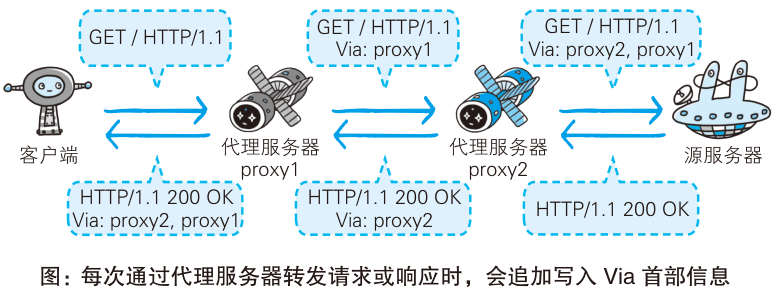
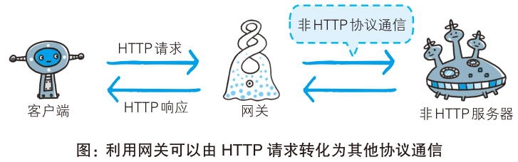
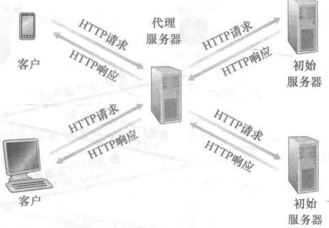

# 代理、网关与缓存

## 代理在客户端和服务器之间做什么?

- 代理（proxy）: 服务器和客户端的中间商，接受客户端请求并转发给服务器，再接受服务器响应并转发给客户端;
- 动机: 客户端不直接连源服务器，中间多一层就有机会缓存、控制访问和记录日志;
- `Via` 首部: 每次通过代理服务器转发请求或响应时，会追加写入 `Via` 首部字段，记录转发路径;
- 三个作用: 基于缓存技术减少网络带宽; 控制访问; 日志管理;
- 缓存代理: 缓存请求资源;
- 透明代理: 不加工转发请求的代理;
- 非透明代理: 加工转发请求的代理;

## 网关和隧道各扩展了什么?

- 网关（gateway）: 类似于代理，转发其他服务器数据的服务器，可以将 HTTP 协议转换为其他通讯协议;
- 网关的价值: 客户端仍然用 HTTP 请求，后端换成非 HTTP 协议通信时，由网关完成协议转换;
- 隧道（tunnel）: 建立客户端和服务器端的通信线路，使用 SSL 进行加密通信;
- 隧道的性质: 隧道本身是透明的，客户端不用在意隧道的存在，只关心和远距离服务器之间的安全通信;

## 缓存为什么能减少访问服务器的次数?

- 缓存: 服务器端的资源副本;
- 作用: 减少对服务器的访问，降低通信流量和响应时间;
- 刷新缓存: 根据客户端要求或者缓存有效期限，缓存服务器再次请求服务器端，刷新缓存资源;
- 客户端缓存: 临时网络文件，存储在磁盘中，具有缓存刷新机制;
- 取舍: 缓存越新越省流量，但越可能返回过期内容，所以刷新机制不可缺;

## Web 缓存器的作用和命中率是什么?

- Web 缓存器: 又称代理服务器，存储用户最近请求的副本; 用户的 HTTP 请求经过配置后首先指向 Web 缓存器;
- 作用一: 减少用户请求的响应时间;
- 作用二: 减少因特网的 Web 流量;
- 命中率: Web 缓存器满足用户请求的比率，命中率越高，需要回源的比例越低;

