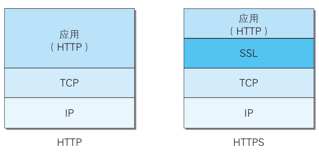
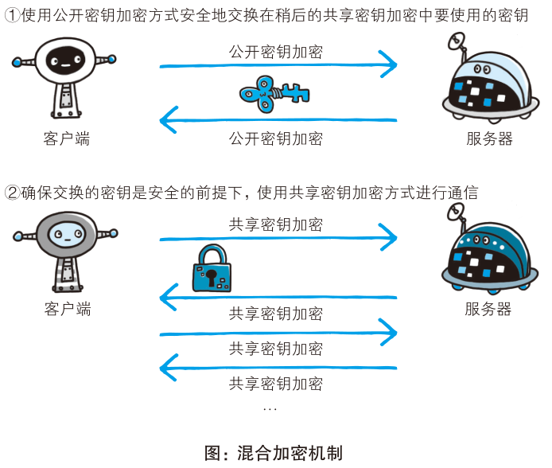

# HTTPS 与加密机制

## HTTP 到底缺了哪三样东西?

- 明文通信: HTTP 使用明文方式发送，链路上任何一处都能看到内容，因此具有窃听风险;
- 无身份验证: HTTP 不会验证通信方身份，无法确定接收方和发送方，无法进行访问权限控制，无法阻止 DDOS 攻击，服务器端和客户端都具有伪装的风险;
- 报文完整性: HTTP 无法保证报文完整性，无法阻止攻击者篡改报文内容，即中间人攻击（MITM）;
- 三者的关系: 窃听、伪装、篡改分别对应机密性、身份与完整性三个方向，缺一个都不算安全;

## 这三个缺陷分别怎么补?

- 明文通信的对策: 协议加密（HTTP + SSL 即 HTTPS，HTTP + TLS），或者对报文内容加密（非对称加密、对称加密）;
- 内容加密的残留问题: 只加密报文内容仍具有篡改风险，因为攻击者不必读懂内容也能改动它;
- 无身份验证的对策: SSL 的证书机制，证书由值得信任的第三方颁发，用于验证身份;
- 报文完整性的对策: 使用 MD5/SHA 等散列值校验，内容被改动时散列值就对不上;

## HTTPS 在协议栈的什么位置?

- HTTPS: 在 HTTP 基础之上加入加密处理、认证和完整性保护等机制;
- 落点: 把 HTTP 通讯接口部分使用 SSL 和 TLS 协议代替;
- SSL 与 TLS 的关系: TLS 是基于 SSL 为原型开发的协议;

## 对称密钥加密为什么不能直接用来加密整个会话?

- 对称密钥加密: 加密和解密共享一个密钥，速度快;
- 风险: 使用对称密钥加密需要传递密钥，而无法保证密钥的安全传递和保管;
- 矛盾点: 双方在通信之前没有共享密钥，而一旦有办法安全传递密钥，就不必担心它被窃听了;

## 非对称密钥加密怎么用，代价是什么?

- 非对称密钥加密: 使用一对非对称密钥，使用公开密钥进行加密，使用私有密钥进行解密;
- 使用方法: 加密方使用对方的公开密钥加密，解密方使用自己的私有密钥解密，因此避免了私有密钥的传递;
- 缺点: 加密和解密速度慢，不适合直接加密整段会话数据;

## 混合加密为什么两种都要用?

- 混合加密机制: HTTPS 使用对称加密和非对称加密两者并用的混合加密方式;
- 分工: 首先使用非对称加密方式安全转发稍后使用的对称加密的密钥，在确保传递密钥安全的前提下使用对称加密;
- 收益: 密钥交换用数据量小的非对称加密保证安全，业务数据用对称加密保证速度;

## 公钥都交换了，为什么还需要证书?

- 残留风险: 混合加密机制只能保证公开密钥的安全转发，不能保证公开密钥是真正的公开密钥;
- 具体威胁: 传输途中具有掉包的风险，攻击者换成自己的公开密钥，之后的对称密钥就落在攻击者手里;
- 证书的角色: 证书由值得信任的第三方颁发，用来证明这把公开密钥确实属于对方;

