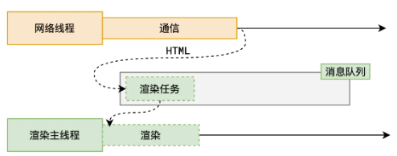
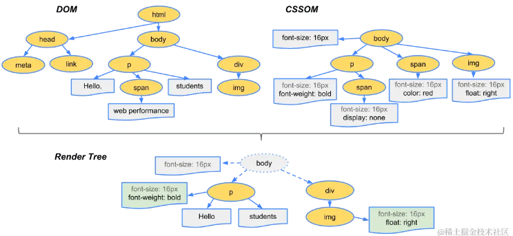

# 渲染流程与渲染堵塞

## 浏览器把 HTML 变成屏幕像素要经过哪几步?

| 步骤          | 做什么                                                |
| ------------- | ----------------------------------------------------- |
| 构建 DOM 树   | 解析 HTML;                                            |
| 构建 CSSOM 树 | 计算 CSS;                                             |
| 解析 js       | 执行页面脚本;                                         |
| 构建渲染树    | 合并 DOM 和 CSSOM;                                    |
| 构建布局树    | 计算 HTML 元素布局（位置和大小）;                     |
| 分层          | 对布局树进行分层，优化后续渲染效率，只对一层进行渲染; |
| 绘制          | 对布局树各图层生成绘制指令;                           |
| 合成          | 通过 GPU 显示;                                        |

- 分块: 合成阶段先分块渲染，把页面拆成更小的区域分别处理;
- 光栅化: 生产像素位图;
- 画: 绘制;
- 顺序的意义: 树结构决定内容，布局决定位置和大小，分层与绘制决定怎么画，合成决定最终由 GPU 显示;

## HTML 是怎么被解析成 DOM 的?

- 解析链路: 字节数据 ==> 字符串 ==> token ==> Node ==> DOM;
- 为什么分这么多步: 字节数据先变成字符串，字符串再切成语义单位 token，token 转成节点，节点连成树，每一步都在缩小"未知"的范围;

## CSS 的解析为什么不堵塞 HTML 却堵塞渲染?

- 解析链路: 与解析 HTML 等同，字节数据 ==> 字符串 ==> token ==> Node ==> CSSOM;
- 为什么不堵塞 HTML: 解析 CSS 在预解析线程执行，渲染主线程不必停下来等它;
- 为什么仍堵塞渲染: CSS 会堵塞渲染树解析，渲染树合不出来，浏览器渲染也就跟着停住;

## 解析 js 为什么会停下 HTML 解析?

- 解析 js 会堵塞 HTML: 遇到 `script` 就暂停解析 HTML，等 JS 下载并执行完再继续;
- 原因: js 中可能修改当前 DOM，如果边执行 js 边解析 HTML，js 看到的 DOM 与最终 DOM 就不一致;
- 代价: 主线程在等待下载和执行期间不能做别的事，页面渲染随之推迟;

## 渲染树是由什么合并出来的?

- 构建渲染树: 合并 DOM 树和 CSSOM 树;
- 内容: 包括显示节点及其样式信息，也就是"要画哪些节点、每个节点长什么样";
- 为什么两棵树都要: DOM 只有结构没有样式，CSSOM 只有样式没有结构，缺一个都无法决定画什么;

## 哪些原因会让渲染被堵塞?

| 原因           | 说明                                                                                                                               |
| -------------- | ---------------------------------------------------------------------------------------------------------------------------------- |
| 网络问题       | 网络请求过多、网络延迟导致外部文件加载缓慢，进而堵塞浏览器渲染;                                                                    |
| css 和 js 解析 | 遇到 link/style/script 时引入外部 css 和 js 文件; js 堵塞 html 解析，css 堵塞渲染树生成; js 和 css 执行时间过长均会堵塞浏览器渲染; |
| GPU 渲染       | gpu 某帧渲染操作过多，无法在 16ms 中渲染完成;                                                                                      |
| js             | 执行时间过长，长时间任务堵塞主线程事件循环; 垃圾回收也堵塞主线程事件循环，导致堵塞浏览器渲染;                                      |

## 怎么从 js、css、gpu 三方面缓解渲染堵塞?

- js 避免耗时操作: 用 web worker 把重活挪出主线程，或用 `setTimeout`/`requestAnimation` 分片执行;
- js 的位置: 将 `script` 标签放置于 body 底部;
- js 的加载方式: 使用 `defer`/`async` 属性延迟或异步加载;
- css 内联: 内联 css 于 HTML 中，省掉一次外部文件请求;
- css 的位置与加载方式: 将大体积 css 放置于 body 底部，或使用 js 动态加载 css;
- gpu: 分片渲染;
