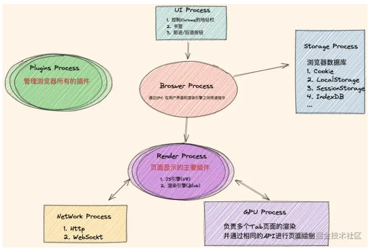

# 浏览器进程与内存

## 浏览器为什么要拆成多个进程，它们怎么通信?

- IPC: 浏览器各进程之间传递消息的机制，浏览器基于 IPC 进行进程间的通信;
- 拆分动机: 一个进程崩掉或跑满时，其他职责还能继续工作，渲染、网络、存储互不拖累;
- 代价: 进程之间不能直接读写彼此的内存，任何协作都要经过消息传递;

## 七类进程各自负责什么?

| 进程            | 职责                    |
| --------------- | ----------------------- |
| Browser Process | 管理不同进程;           |
| Render Process  | js 引擎和渲染引擎;      |
| NetWork Process | 负责网络协议;           |
| GPU Process     | 负责页面渲染;           |
| Plugins Process | 负责浏览器插件;         |
| UI Process      | 负责地址栏/书签/跳转等; |
| Storage Process | 负责本地存储;           |

## 内存泄露通常由哪六件事造成?

- 意外生成的全局变量: 意外生成的全局变量导致无法被垃圾回收;
- 遗忘的定时器或回调函数: 定时器或回调被遗忘后依然存在，相关对象无法被回收;
- 大量的 console: 大量 console 输出;
- 不正确地使用闭包: 闭包使用不正确，外部变量被长期持有;
- 不正确地删除 DOM: 删除 DOM 的方式不正确，浏览器依旧保持对 DOM 的引用;
- 循环引用问题: 对象之间互相循环引用;
- 共同后果: 这些对象都无法被垃圾回收，内存占用只增不减;

## 哪些操作会被 GPU 加速?

- 页面滚动;
- transform;
- css 动画;
- canvas 绘图;

## 浏览器提供了哪些安全措施?

- https;
- 同源策略;
- 内容安全策略（CSP）: 设置可信内容，减少 XSS 风险;
- XSS 防护: cookie `httpOnly`;
- CSRF 防护: cookie `SameSite`;
- 证书验证;
- 隐私模式;
- 弹窗拦截;
- 下载扫描;
- 拓展扫描;
- 密码管理器;
- 表单自动填充保护;

## 怎么监控 fps?

| 环境     | 方法                                                         |
| -------- | ------------------------------------------------------------ |
| 开发环境 | 开发者工具 - more tools - rendering - frame rendering stats; |
| 生产环境 | `requestAnimationFrame`;                                     |

- 为什么要看 fps: 一帧要在 16ms 内渲染完成，fps 掉下来就说明某帧的操作超出了这份预算;
