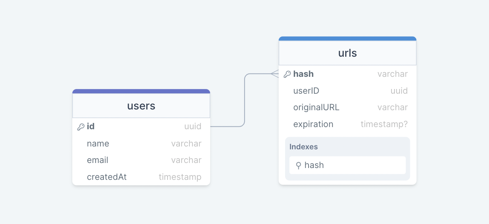
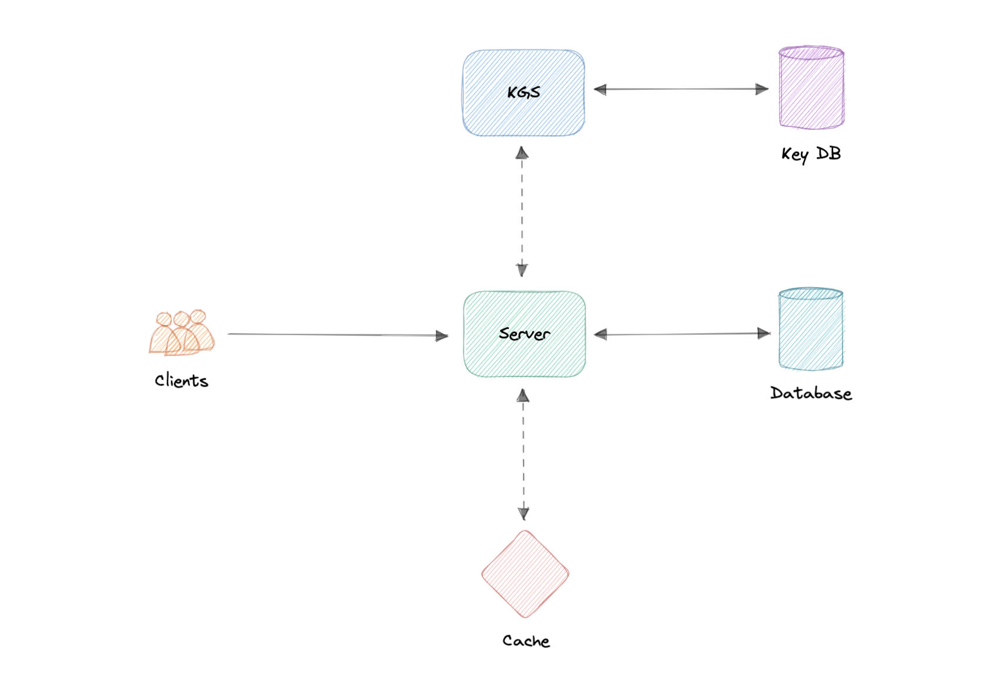
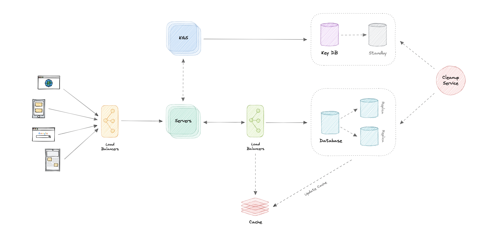

# URL Shortener

URL Shortener 怎样把长 URL 映射为唯一别名并快速重定向? 如何生成唯一短码? KGS 怎样避免并发重复? 读多写少的缓存、分片、过期清理和防滥用如何设计? 哪些单点必须消除?

URL Shortener 为长 URL 创建短别名。用户访问短链接时被重定向到原始地址。它能节省分享空间、降低手工输入错误，还可以针对设备优化链接并追踪每个链接的访问。

## 需求

- 核心功能: 输入长 URL 生成唯一短链接; 访问短链接重定向原地址; 链接按默认期限过期;
- 非功能: 高可用、低重定向延迟、可水平扩展;
- 扩展: API 防滥用、私有链接、访问分析与指标;

## 量级假设

- 写入: 每月 1 亿新链接，约 `40/s`;
- 读取: 读写比 `100:1`，约 `4000/s` 重定向;
- 带宽: 每次约 500 B，入口约 `20 KB/s`，出口约 `2 MB/s`;
- 存储: 保留 10 年，共 120 亿条，约 `6 TB` 原始记录;
- 缓存: 每日约 3.5 亿读取; 若缓存 20% 热点且每项 500 B，约 `35 GB`;
- 注意: 以上是平均值，生产容量还需加入峰值、索引、副本和增长余量;

完整推导如下：

```text
每月读取 = 100 × 1 亿 = 100 亿
写 RPS = 1 亿 / (30 × 24 × 3600) ≈ 40/s
读 RPS = 100 × 40 ≈ 4000/s
入口带宽 = 40 × 500 B ≈ 20 KB/s
出口带宽 = 4000 × 500 B ≈ 2 MB/s
十年记录数 = 1 亿 × 12 × 10 = 120 亿
十年原始存储 = 120 亿 × 500 B ≈ 6 TB
每日读取 = 4000 × 86400 ≈ 3.5 亿
热点缓存 = 20% × 3.5 亿 × 500 B ≈ 35 GB
```

| 指标           |     估算 |
| -------------- | -------: |
| 新链接写入     |     40/s |
| 重定向读取     |   4000/s |
| 入口带宽       |  20 KB/s |
| 出口带宽       |   2 MB/s |
| 十年原始存储   |     6 TB |
| 热点缓存工作集 | 约 35 GB |

`35 GB` 是用 80/20 假设得到的热点工作集，不是每天永久追加的容量。真实系统要用访问分布、TTL 和目标命中率校准。

## 数据与 API

- `users`: 用户、API key 与配额;
- `urls`: `hash`、`originalURL`、`expiration`、`userID` 与创建时间; `hash` 建唯一索引;
- 数据库: 访问路径主要是按短码点查、关系较弱，可选 DynamoDB、Cassandra、MongoDB; SQL 同样可行，取决于规模与运维能力;

```text
createURL(apiKey, originalURL, expiration?) -> shortURL
getURL(apiKey, shortURL) -> originalURL
deleteURL(apiKey, shortURL) -> boolean
```

- API key: 标识调用者并落实每秒或每分钟配额，降低自动化滥用;

`createURL` 接收 API key、原始 URL 和可选过期时间，返回新短链接；`getURL` 根据短链接返回原始地址；`deleteURL` 删除指定映射并返回成功与否。API key 是开发者 API 的常见防滥用手段，也是授权和配额的主体。



## 短码生成

- Base62: 用 `A-Z`、`a-z`、`0-9` 编码; 长度 `N` 的空间为 `62^N`;
- 容量: 6 位约 568 亿，7 位约 3.5 万亿;
- URL 哈希: `MD5(originalURL) → Base62 → 截断`; 简单但截断会碰撞，需检测并重算;
- 单计数器: 递增 ID 再 Base62，天然唯一; 单计数器是故障与吞吐瓶颈;
- 分段计数: 协调服务为节点分配不重叠 ID 范围，节点本地生成，兼顾唯一与吞吐;

容量公式为 `62^N`：5 位约 9.16 亿，6 位约 568 亿，7 位约 3.5 万亿。Base62 只定义编码空间，本身并不消除碰撞。

MD5 方案可表示为：

```text
MD5(originalURL) → Base62 编码 → 截取 7 位短码
```

截断会发生碰撞，重复计算直到唯一会增加查询和计算开销。单计数器再 Base62 天然唯一，但计数器会成为单点；直接部署多个独立计数器又会重复。ZooKeeper 一类协调系统可以分配区间：

```text
节点 A: 1..1,000,000
节点 B: 1,000,001..2,000,000
节点 C: 2,000,001..3,000,000
```

节点耗尽区间后再领取新范围，协调系统本身也要多实例。

## KGS

- KGS（Key Generation Service）: 预生成唯一短码，放入未使用池，创建链接时领取;
- 并发安全: 把未使用键原子移动到已使用集合，或按批次把独占键加载到实例内存;
- 容量: 568 亿个 6 字符键的原始字符约 340 GB，考虑索引后更大，但生命周期内不随链接内容线性复制;
- 可用性: KGS 多实例，键库有副本; 实例崩溃时允许少量已领取未使用键浪费，避免重新发放导致碰撞;

原材料估算 568 亿个 6 字符键约占 390 GB；按纯字符二进制换算约 340 GiB，索引还会继续放大。关键点是它覆盖整个服务生命周期，容量不会像主链接库那样持续随业务记录增长。

## 请求路径

- 创建: 客户端 → 网关 → API → KGS 领取短码 → 写数据库与缓存 → 返回 `201`;
- 读取: 客户端 → API → 缓存; 命中返回 `301/302`; 未命中查库并回填; 不存在返回 `404`;
- 缓存: 热点短码用 LRU 等策略; 缓存不是唯一数据源，未命中必须可回源;



创建路径的准确顺序是：API 向 KGS 申请键，KGS 返回并标记为已使用，API 再写数据库和缓存，最后返回 `201 Created`。访问路径先查缓存，未命中再查库并回填；找到后原材料使用 `301 Redirect`，找不到返回 `404 Not Found`。若目标以后可能修改或必须精确记录每次访问，应重新评估 `301` 的客户端缓存影响。

## 数据与生命周期

- 分片: 按短码哈希水平分片; 一致性哈希减少节点变化时迁移;
- 主动清理: 后台任务周期删除已过期数据库与缓存项;
- 被动清理: 访问时发现过期再删除; 节省扫描但会保留冷垃圾;
- 组合: 被动保证语义，主动回收容量;
- 分析: 访问国家、平台、次数等写入异步事件，避免拖慢重定向主路径;
- 私有链接: 单独维护授权关系; 无权访问返回合适的认证或授权错误;

缓存可选 Redis 或 Memcached，并用 LRU 优先淘汰最久未使用的键。指标可记录访问者国家、平台和访问次数；高流量下更适合把分析事件异步写出，避免同步更新热点 URL 行。私有链接可用独立表维护获准访问的用户 ID。原材料写作 `401 Unauthorized`；实际接口中未认证通常返回 `401`，已认证但无权限通常返回 `403`。

## 韧性



- API、KGS、缓存与数据库均多实例并经健康检查分流;
- 读多写少: 数据库部署多个读副本，缓存使用分片和副本;
- KGS 键库: 独立备库与一致性校验，避免重复短码;
- API Gateway: 集中做认证、授权、限流与负载均衡，但自身必须冗余;

还应明确回答：API 或 KGS 崩溃怎么办、组件之间如何分流、怎样降低数据库负载、KGS 键库失败怎么办，以及如何提高缓存可用性。负载均衡应覆盖客户端到服务、服务到数据库和缓存的关键路径。
