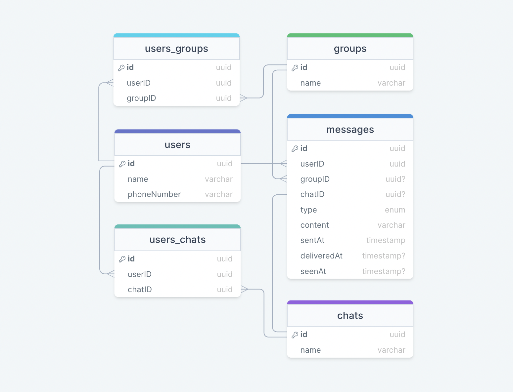
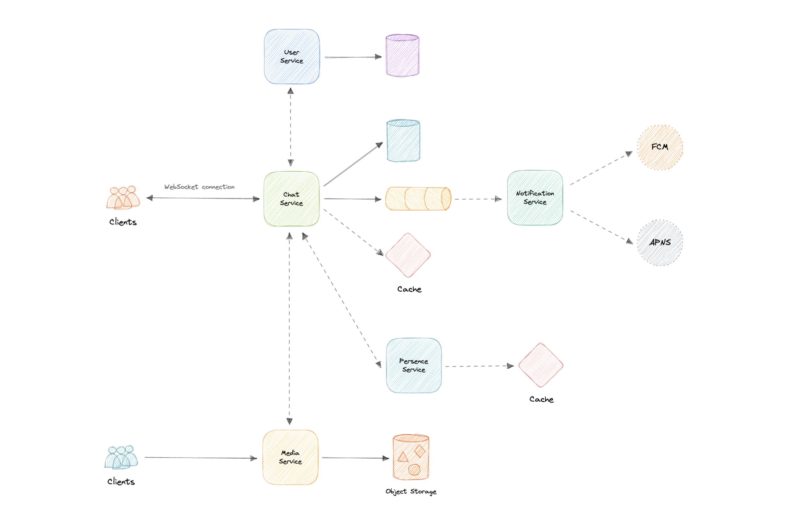
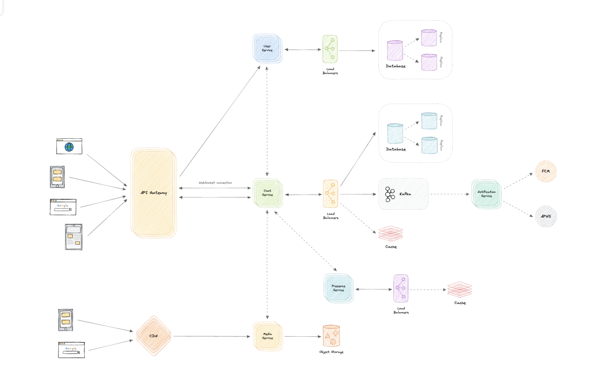

# WhatsApp

WhatsApp 怎样满足单聊、群聊、媒体和回执? 如何估算消息与媒体规模? WebSocket、在线状态、通知、分片、缓存与对象存储怎样协作? 消息顺序和恰好一次为什么困难?

WhatsApp 是面向移动端和 Web 的即时通信应用。原材料以类似 Facebook Messenger、微信的服务为参照；产品背景是连接 180 多个国家的 20 多亿用户，但下面的容量设计采用独立的 5000 万 DAU 假设。

## 需求

- 核心功能: 一对一聊天、最多 100 人群聊、图片/视频/文件分享;
- 非功能: 高可用、低消息延迟、水平扩展与高效率;
- 扩展: 已发送/已送达/已读回执、最后在线时间、离线推送;

## 量级假设

- 用户: 5000 万 DAU，每人每天给 4 人各发 10 条，共 20 亿消息/天;
- 请求率: 约 `24K/s` 平均消息写入;
- 媒体: 5% 消息含媒体，即 1 亿文件/天;
- 文本存储: 平均 100 B，约 `200 GB/天`;
- 媒体存储: 平均 100 KB，约 `10 TB/天`; 加文本保留 10 年约 `38 PB`;
- 入口带宽: 约 `10.2 TB/天 ≈ 120 MB/s`，还需按峰值与副本放大;

推导过程：

```text
消息量 = 5000 万 × 4 人 × 10 条 = 20 亿条/天
平均消息 RPS = 20 亿 / 86400 ≈ 24K/s
媒体量 = 5% × 20 亿 = 1 亿个/天
文本 = 20 亿 × 100 B ≈ 200 GB/天
媒体 = 1 亿 × 100 KB ≈ 10 TB/天
十年存储 = (10 TB + 0.2 TB) × 365 × 10 ≈ 38 PB
入口带宽 = 10.2 TB / 86400 ≈ 120 MB/s
```

| 指标         |        估算 |
| ------------ | ----------: |
| DAU          |     5000 万 |
| 平均消息请求 |       24K/s |
| 每日存储     |  约 10.2 TB |
| 十年存储     |    约 38 PB |
| 平均入口带宽 | 约 120 MB/s |

## 数据与 API

- `users`: 用户资料与设备;
- `messages`: `type`、`content/mediaURL`、`chatID/groupID`、发送/送达/已读时间;
- `chats`、`groups`: 单聊与群组;
- `users_chats`、`users_groups`: 用户与会话的多对多关系;
- 数据所有权: 按服务拆分，不强迫所有表进入一个数据库; 元数据可用 PostgreSQL，海量消息可用 Cassandra 等分布式存储;



`users_chats` 和 `users_groups` 分别表达用户与单聊、群组之间的多对多关系。数据模型看似关系化，但把所有表放进单库会限制扩展；各服务拥有自己的数据后，可以按访问模式分别选择 PostgreSQL 或 Cassandra。

```text
getAll(userID) -> Chat[] | Group[]
getMessages(userID, channelID, cursor?) -> Message[]
sendMessage(userID, channelID, message) -> boolean
joinGroup(userID, channelID) -> boolean
leaveGroup(userID, channelID) -> boolean
```

- `getAll`：返回用户加入的全部私聊和群组;
- `getMessages`：按 chat/group 的 `channelID` 读取消息，生产接口应加入游标分页;
- `sendMessage`：发送文本、图片、视频或文件消息;
- `joinGroup` / `leaveGroup`：改变用户与频道的成员关系;
- 所有接口都必须基于当前用户身份做成员关系和权限校验。

## 服务边界

- User Service: 认证与用户资料;
- Chat Service: WebSocket 连接、单聊消息路由与会话;
- Group Service: 群成员和群消息 fanout，避免 Chat Service 责任过重;
- Presence Service: 在线连接与最后活跃时间;
- Media Service: 上传、处理和对象存储;
- Notification Service: 离线推送;
- 内部通信: 延迟敏感调用可用 gRPC; 服务目录或 Mesh 管理动态地址、安全与遥测;

原材料把 User Service 描述为 HTTP 服务，把 Chat Service 作为 WebSocket 连接和聊天/群聊的中心。若一个 Chat Service 同时承担连接、消息持久化、群组扇出和在线状态，会责任过重；可以继续拆分连接网关、消息服务和 Group Service。微服务之间可用 REST/HTTP，也可用更轻量的 gRPC；Service Discovery 或 Service Mesh 负责动态寻址、可观测和安全通信。

## 实时消息与在线状态

- 选择 WebSocket: 全双工长连接允许客户端与服务端低延迟互发，优于反复长轮询，SSE 又只能单向;
- 连接目录: 把 `userID → gateway/connection` 放入分布式缓存，消息路由到持有连接的节点;
- 心跳: 客户端周期上报存活，Presence Service 刷新缓存中的 `lastActiveAt`;
- 惰性状态: 也可用最近用户动作推断在线; 开销低但精度取决于阈值;
- 断线恢复: 客户端携带最后确认消息游标重连，服务器补发缺口并去重;

拉模型让客户端周期性长轮询，许多响应为空，会浪费服务端资源并增加延迟。推模型保持长连接，数据到达即可下发。WebSocket 同时支持客户端到服务端和服务端到客户端的全双工通信，SSE 只有服务端到客户端的单向通道，因此聊天主通道选择 WebSocket。

在线状态可存成低开销缓存：

| key    | last active value     |
| ------ | --------------------- |
| User A | `2022-07-01T14:32:50` |
| User B | `2022-07-05T05:10:35` |
| User C | `2022-07-10T04:33:25` |

心跳能主动确认连接存活；惰性方案则记录最近动作，超过例如 30 秒无动作便显示离线。后者写入更少，但在线判断更不精确。

## 通知与回执

- 离线通知: Chat Service 判断接收者无活跃连接，把平台与消息元数据写入队列;
- Notification Service: 消费后调用 FCM、APNS、Web Push、短信或邮件;
- 队列价值: 解耦第三方延迟并吸收峰值; 至少一次交付要求通知端幂等;
- Delivered: 接收客户端返回 ACK 后更新 `deliveredAt`;
- Read: 用户打开会话并确认读位置后更新 `seenAt`，群聊宜用每成员读游标而非每消息一行;

通知事件携带设备平台，Notification Service 再路由到 FCM、APNS 或 Web Push，也可扩展到邮件和短信。原材料选择 SQS 或 RabbitMQ 一类队列，原因是至少一次交付和尽力保持顺序；这不是典型的后端 fanout pub/sub，因为移动端和浏览器通知最终由不同外部平台处理。

送达回执要等待客户端 ACK 后更新 `deliveredAt`；用户真正打开会话后才更新 `seenAt`。服务器写入成功、设备收到和用户阅读是三种不同事实，不能由一个状态代替。

## 媒体、缓存与分区

- 媒体: 二进制放对象存储或分布式文件系统，消息只保存元数据和 URL;
- CDN: 从边缘交付图片与视频，降低源站带宽与延迟;
- 分页: 按游标向前读取消息，避免一次传输数千条历史;
- 缓存: 缓存活跃会话与较旧热点消息; 最新消息以持久写入与游标语义为准;
- 分片: 按 `channelID` 分片，把同一会话消息放在一起以维护局部顺序; 一致性哈希辅助扩缩;

对象存储把文件组织为对象并可跨网络系统扩展，可选择 Amazon S3、Azure Blob Storage 或 Google Cloud Storage，也可以使用 HDFS、GlusterFS 等分布式文件系统。静态图片和视频经 CloudFront、Cloudflare 等 CDN 分发，提高可用性与冗余并降低带宽成本。

缓存要谨慎：聊天用户期待最新数据，但群聊中的历史消息会被多人反复读取，因此适合缓存较旧消息。API 必须分页，避免一次传输几千条历史；Redis 或 Memcached 可采用 LRU，未命中再回源并回填。

由于入口同时存在 HTTP、WebSocket 和 TCP/IP 等协议，为每种协议分别部署 L4/L7 负载均衡会增加成本。支持多协议的 API Gateway 可以统一入口，并提供认证、授权、限流、节流和版本管理。

## 韧性与语义





- 多实例: 网关、服务、缓存与数据库都需副本和健康检查;
- 消息顺序: 全局顺序不现实; 明确定义会话内或分区内顺序;
- 恰好一次: 网络重试会重复; 用客户端消息 ID、幂等写和去重实现一次业务效果;
- 媒体成本: 上传后异步压缩、转码与生命周期归档;
- 观测: 连接数、发送到送达延迟、积压年龄、重连率、重复率与推送失败率;

还要追问服务崩溃、流量分配、数据库减压、缓存高可用、API Gateway 单点、通知可靠性、媒体成本和 Chat Service 职责。服务、网关、缓存和数据库都需多实例；读副本分担读取；Kafka、NATS 等消息代理可增强通知路径，但分布式系统中的全局恰好一次与全局顺序依然困难。媒体处理和压缩可以显著降低长期存储成本。
