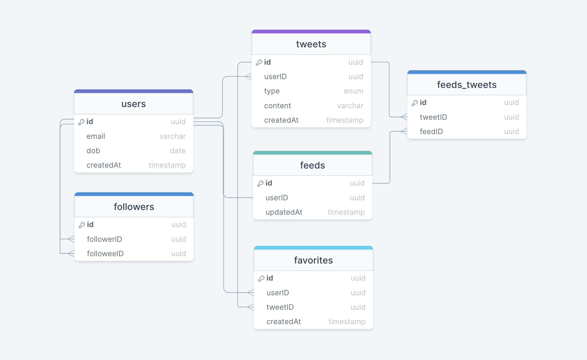
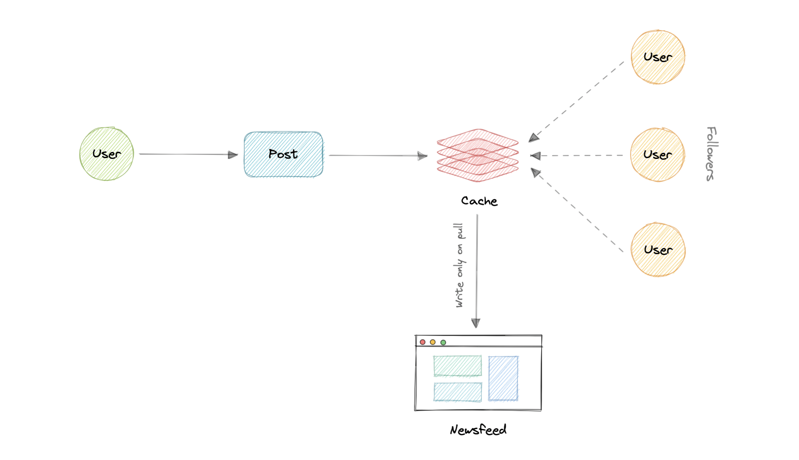
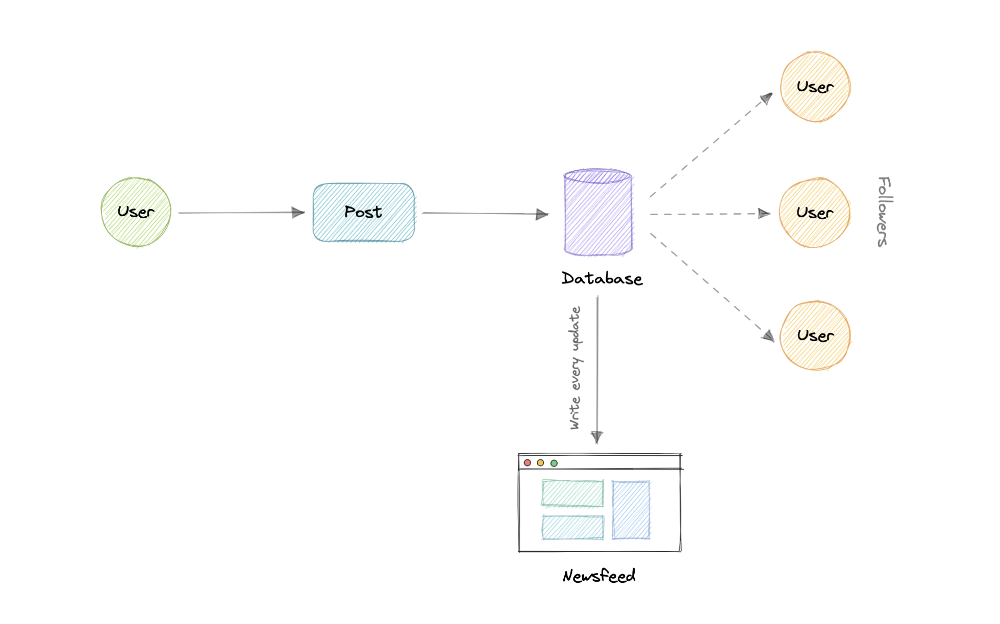
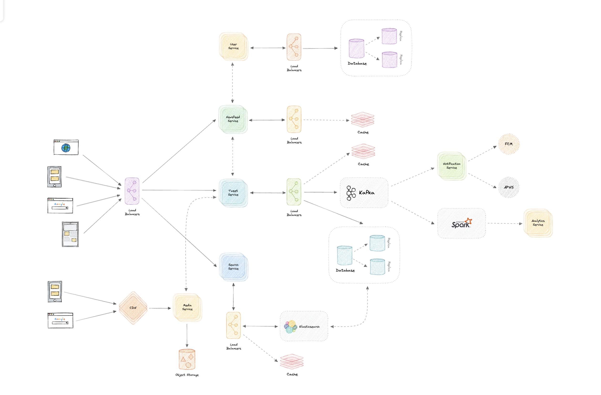

# Twitter

Twitter 怎样发布内容、关注、生成信息流与搜索? push、pull 和混合 fanout 如何处理普通用户与名人? 排序、转发、趋势、社交图、媒体与分析怎样拆分? 如何保护新鲜度与可用性?

Twitter 是社交网络和微博客服务，用户可以发布 tweet、关注其他用户，并在 Web、Android 和 iOS 等平台阅读信息流。下面的设计同样适用于包含关注关系和个性化 feed 的内容平台。

## 需求

- 核心功能: 发布文本/图片/视频，关注用户，查看关注信息流，搜索内容;
- 非功能: 高可用、低延迟、可扩展与高效率;
- 扩展: 指标分析、转发、收藏;

## 量级假设

- 用户: 10 亿总用户，2 亿 DAU，每人每天发 5 条，共 10 亿条/天;
- 请求率: 约 `12K/s` 平均发布;
- 媒体: 10% 内容含媒体，即 1 亿文件/天;
- 存储: 文本平均 100 B 约 `100 GB/天`; 媒体平均 50 KB 约 `5 TB/天`;
- 十年: 约 `19 PB`; 每日入口约 `5.1 TB ≈ 60 MB/s`;
- 校验: 原材料汇总表把 DAU 写为 1 亿，与前述 2 亿假设不一致; 估算应以显式公式中的 2 亿为准并在真实设计时重新确认;

```text
tweet = 2 亿 DAU × 5 条 = 10 亿条/天
平均发布 RPS = 10 亿 / 86400 ≈ 12K/s
媒体 = 10% × 10 亿 = 1 亿个/天
文本 = 10 亿 × 100 B ≈ 100 GB/天
媒体 = 1 亿 × 50 KB ≈ 5 TB/天
十年存储 = (5 TB + 0.1 TB) × 365 × 10 ≈ 19 PB
入口带宽 = 5.1 TB / 86400 ≈ 60 MB/s
```

## 数据与 API

- `users`、`tweets`: 用户与内容;
- `followers`: `followerID → followeeID` 有向边;
- `favorites`: 用户收藏内容;
- `feeds`、`feeds_tweets`: 预生成信息流及其内容映射;
- 数据所有权: 用户、内容、信息流、搜索、媒体、通知、分析分别拥有数据;



`followers` 映射 follower 与 followee 的多对多有向关系；`feeds` 保存某个用户的 feed 属性，`feeds_tweets` 再表达 feed 与 tweet 的多对多关系。与 WhatsApp 一样，不应因为模型存在关系就把所有数据塞进一个数据库；各服务可分别使用 PostgreSQL 或 Cassandra。

```text
postTweet(userID, content, mediaURL?) -> boolean
follow(followerID, followeeID) -> boolean
unfollow(followerID, followeeID) -> boolean
getNewsfeed(userID, cursor?) -> Tweet[]
```

`postTweet` 接收用户、文本和可选媒体 URL；`follow` / `unfollow` 改变关注关系；`getNewsfeed` 返回给定用户的信息流。生产接口需增加身份校验、游标分页和幂等键。

## 服务边界

- User Service: 用户与关注关系;
- Tweet Service: 发布、收藏与转发;
- Newsfeed Service: 生成、排序和发布信息流;
- Search Service: 全文检索与趋势;
- Media Service: 上传、处理和对象存储;
- Notification / Analytics Service: 推送与事件分析;

服务间可以用 REST/HTTP 或更轻量的 gRPC，通过 Service Discovery 或 Service Mesh 解决动态地址、可观测和安全通信。每个服务拥有自己的数据，降低单一数据库成为扩展瓶颈的风险。

## 信息流生成

1. 取得用户关注的人、话题和标签;
2. 拉取对应候选内容;
3. 按相关性、时间和互动排序;
4. 分页返回并缓存预生成结果;

- pull / fanout on load: 读时聚合关注者内容; 写少、写放大低，但读取慢且读放大高;
- push / fanout on write: 发布时把内容推入每个粉丝 feed; 读取快，但名人会产生巨量写放大;
- hybrid: 普通用户用 push，超多粉丝用户用 pull，读时合并两部分;

生成 feed 是高成本过程，特别是用户关注很多实体时。可预生成并缓存结果，再周期性拉取新 tweet、重排和更新。



pull 模型降低写入次数，但只有用户请求时才生成最新 feed，读放大和延迟较高。



push 模型在发布时立即写入每个粉丝的 feed，读取很快，却把名人的百万级粉丝放大成巨量写入。混合模型让普通用户走 push、名人走 pull，读时合并两部分。

## 排序与扩展功能

- 示例排序: `Rank = Affinity × Weight × Decay`;
- Affinity: 用户与作者的互动接近度;
- Weight: 评论、转发、点赞等行为的权重;
- Decay: 内容随时间衰减; 真实系统通常加入机器学习特征;
- 转发: 新内容引用原内容 ID; 复杂统计可独立建 `retweets` 关系;
- 搜索: Elasticsearch 等倒排索引提供近实时文本、数值和地理搜索;
- 趋势: 缓存最近 `N` 秒高频查询、标签与主题，每 `M` 秒聚合并排序;
- 共同好友: 关注关系构成有向图; 图数据库可支持多跳与共同邻居查询;

转发的最小实现是创建一条新 tweet，把 `type` 设为 `tweet`，`content` 保存原 tweet ID：

| id        | userID    | type    | content   |
| --------- | --------- | ------- | --------- |
| 原内容 ID | 作者 ID   | `text`  | 原始文本  |
| 转发 ID   | 转发者 ID | `tweet` | 原内容 ID |

规模扩大后可用独立 `retweets` 表承载转发关系和统计。

Elasticsearch 构建于 Lucene 之上，可近实时搜索文本、数值、地理、结构化和非结构化数据。趋势建立在搜索之上：缓存最近 `N` 秒最频繁的查询、标签和话题，每 `M` 秒用批任务刷新，再用排序算法加权和个性化。

共同好友可把每个用户作为节点、关注作为有向边，遍历邻居寻找共同关系。Neo4j、ArangoDB 等图数据库适合多跳查询；要提高推荐质量，还需加入机器学习模型，而不只是共同邻居计数。

## 数据与媒体

- 分片: 内容可按 ID 哈希，关注关系按用户分区; 跨 shard 操作通过服务聚合;
- 缓存: 热门内容与 feed 页缓存，使用游标分页; 新鲜数据需明确更新与失效策略;
- 媒体: 对象存储保存文件，CDN 边缘分发，异步压缩减少成本;
- 分析: 业务事件进入 Kafka 等日志，再由 Spark 等系统离线或流式处理;
- 通知: 队列解耦通知服务与 FCM/APNS，消费端幂等并处理重试;

Kafka 可以承载发布、互动等事件，Spark 再进行大规模分析。对象存储或 HDFS、GlusterFS 保存媒体，CDN 提高静态文件可用性与冗余并降低带宽成本。缓存可保存顶部 20% 热点 tweet，采用 LRU；未命中回源并回填。所有列表接口都应分页，避免低带宽用户被迫加载旧内容。

## 韧性



- 所有无状态服务、缓存、数据库与搜索索引采用多实例和副本;
- 负载均衡器隔离入口，读副本分担热点读取;
- 名人 fanout、热门话题和病毒内容必须单独限流、分片与缓存;
- 降级: 排序服务故障时返回时间序或缓存 feed; 分析和通知不阻塞发布主路径;
- 观测: feed 生成延迟、新鲜度、fanout 积压、搜索索引滞后和缓存命中率;

完整检查还包括：任一服务崩溃怎么办、组件如何分流、如何降低数据库负载、缓存怎样高可用、通知怎样更可靠、媒体成本怎样降低。服务和缓存部署多实例，数据库增加读副本，通知使用 Kafka 或 NATS；媒体服务通过处理和压缩降低大文件存储成本。分布式环境下严格恰好一次与全局顺序依然需要业务幂等和明确的顺序范围。
