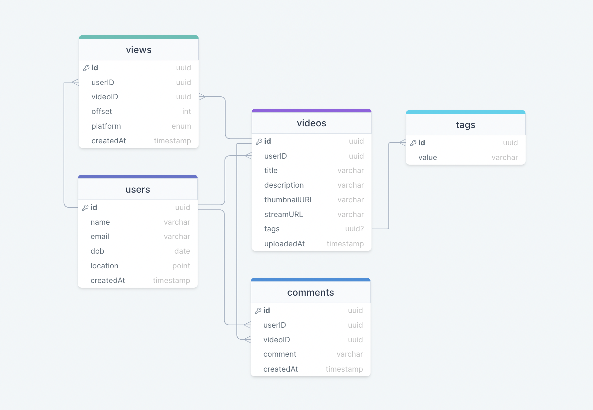
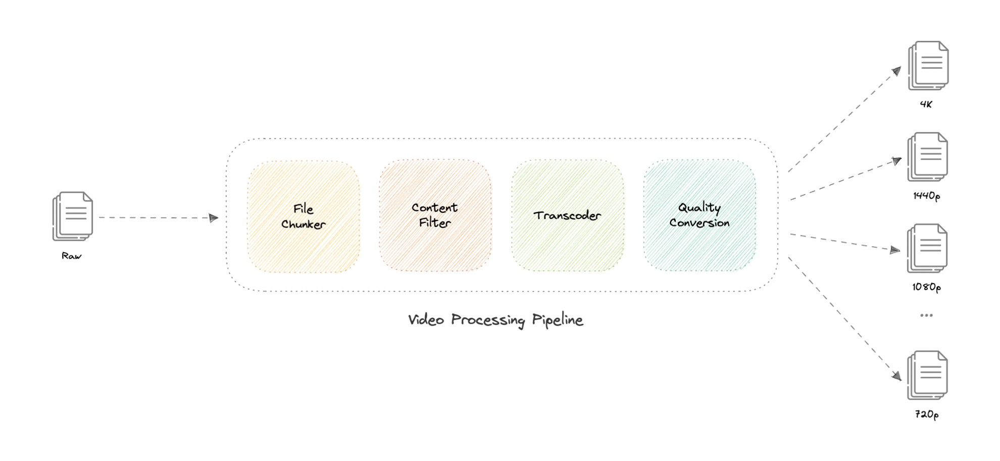
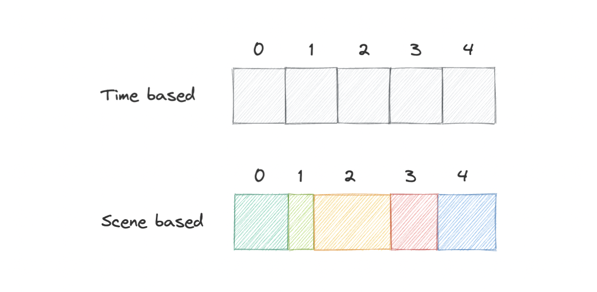
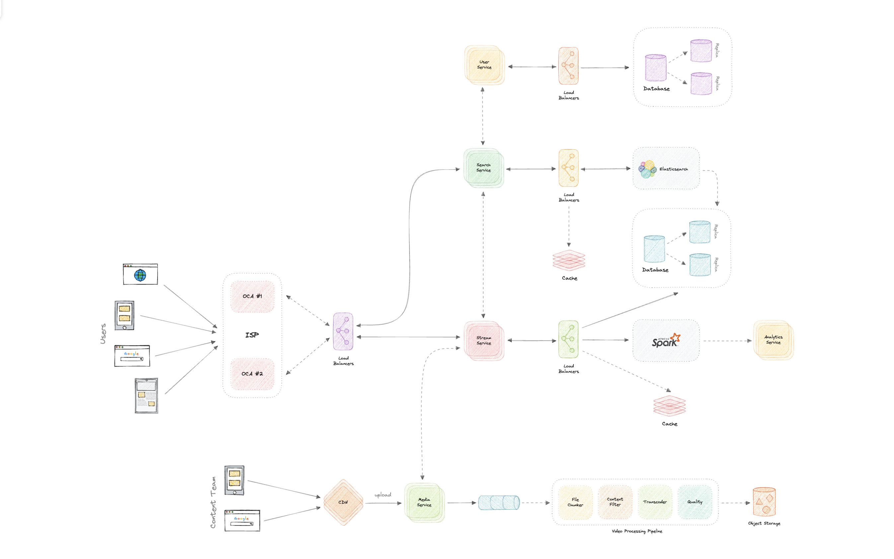

# Netflix

Netflix 怎样上传、处理、搜索和自适应播放? 如何估算 PB 级存储与带宽? 分块、内容审核、转码、多清晰度、CDN 和断点续播怎样串成管道? 如何支持地域限制与推荐?

Netflix 是订阅制流媒体服务，会员可以在联网的 Web、iOS、Android、电视等设备观看电影和剧集。原材料同时把 YouTube 一类允许用户上传内容的平台纳入设计，因此上传者既可以是内容团队，也可以是普通用户。

## 需求

- 核心功能: 上传、播放与分享视频; 按标题或标签搜索; 评论;
- 非功能: 高可用、低延迟、高可靠且上传不丢失、可水平扩展;
- 扩展: 地域限制、断点续播、指标与分析;

## 量级假设

- 用户: 2 亿 DAU，每人每天看 5 个视频，共 10 亿播放/天;
- 读写比: `200:1`，约 500 万上传/天;
- 请求率: 约 `12K/s` 平均播放请求;
- 存储: 平均视频 100 MB，约 `500 TB/天`; 十年约 `1825 PB`;
- 入口带宽: 约 `500 TB/天 ≈ 5.8 GB/s`; 播放出口通常更大，必须结合实际码率另算;
- 放大: 多编码、多分辨率、副本、缩略图和索引会让真实存储显著高于原始上传量;

```text
每日播放 = 2 亿 DAU × 5 = 10 亿
平均播放请求 = 10 亿 / 86400 ≈ 12K/s
每日上传 = 10 亿 / 200 = 500 万
每日原始存储 = 500 万 × 100 MB ≈ 500 TB
十年原始存储 = 500 TB × 365 × 10 ≈ 1825 PB
平均入口带宽 = 500 TB / 86400 ≈ 5.8 GB/s
```

| 指标         |     估算 |
| ------------ | -------: |
| DAU          |     2 亿 |
| 平均播放请求 |    12K/s |
| 每日上传     |   500 万 |
| 每日原始存储 |   500 TB |
| 十年原始存储 |  1825 PB |
| 平均入口带宽 | 5.8 GB/s |

## 数据与 API

- `users`: 用户与订阅;
- `videos`: 标题、描述、`streamURL`、状态、作者与处理元数据;
- `tags`、`comments`: 分类与评论;
- `views`: 用户、视频、播放 offset、设备与时间;



`users` 保存用户资料；`videos` 保存标题、播放 URL、标签、上传者和处理状态；`tags` 维护分类；`views` 保存观看记录和断点；`comments` 保存评论。数据可按服务拆分到 PostgreSQL 或 Cassandra，不要求单库承载所有关系。

```text
uploadVideo(title, description, stream, tags?) -> uploadID
streamVideo(videoID, codec, resolution, offset?) -> VideoStream
searchVideo(query, nextPage?) -> Video[]
comment(videoID, comment) -> boolean
```

- `uploadVideo`：接收标题、描述、视频字节流和可选标签，返回上传任务标识;
- `streamVideo`：接收视频 ID、H.265/H.264/VP9 等 codec、目标分辨率和可选秒级 offset，返回视频流;
- `searchVideo`：按标题或标签搜索，并用 `nextPage` token 分页;
- `comment`：给指定视频增加评论;
- 上传接口的“成功”应表示原始文件已可靠持久化，而不是全部转码已经完成。

## 服务边界

- User Service: 用户与认证;
- Media Service: 分块上传、校验、处理与存储;
- Stream Service: 鉴权、播放清单、码率选择和断点续播;
- Search Service: 标题、标签与趋势;
- Analytics Service: 播放质量、行为与内容指标;
- 数据: 元数据按服务存数据库，大对象进入对象存储或分布式文件系统;

服务间可用 REST/HTTP，也可用 gRPC 降低内部调用开销；Service Discovery 或 Service Mesh 负责动态寻址、可观测和安全通信。评论功能可以归入独立互动服务，避免 Stream Service 承担非播放职责。

## 视频处理管道



1. File Chunker: 把大文件切成可并行、可重试的块; 按场景切分可降低播放跨场景中断;
2. Content Filter: 用模型检查版权、盗版、分级与不安全内容; 不确定任务进入 DLQ 供人工审核;
3. Transcoder: 解码后按 H.264、H.265、VP9 等目标 codec 重编码，调整码率与尺寸;
4. Quality Conversion: 生成 4K、1440p、1080p、720p 等多个版本;
5. Enrichment: 可继续生成字幕、缩略图、指纹和搜索元数据;
6. Publish: 处理成功后原子更新视频状态与播放清单，再向 CDN 预热或等待拉取;

两小时原始 8K 素材可能达到约 4 TB，处理管道既为设备兼容，也直接决定存储和交付成本。



- File Chunker：普通方案可按时间切成等长块；Netflix 按场景切块，使客户端请求一个块时更可能拿到完整场景并减少跨场景中断。分块也便于只传变化部分和消除重复数据;
- Content Filter：Netflix 内容可由分级预审，UGC 平台则需要严格审核。机器学习模型检查版权、盗版和 NSFW；可疑任务进入 DLQ，由审核团队处理;
- Transcoder：先解码为中间未压缩格式，再用目标 codec 重编码，可调整码率、缩放画面并优化设备格式。可用 FFmpeg 或 AWS Elemental MediaConvert;
- Quality Conversion：从转码产物生成 4K、1440p、1080p、720p 等版本，之后写入 HDFS、GlusterFS 或 S3 等存储;
- 扩展步骤：字幕、缩略图、内容指纹和搜索元数据生成。

处理是长任务，因此上传完成后通过 SQS、RabbitMQ 等队列异步执行。队列把上传与处理解耦，各阶段必须幂等，失败进入重试或 DLQ。

- 队列: 上传快速确认后异步处理长任务，按阶段重试并隔离失败;
- 幂等: 每个块和处理阶段用稳定任务 ID，重试不得生成重复产物;

## 播放

- CDN: 从靠近用户的边缘交付切片，减少回源和跨洲延迟;
- Open Connect 类方案: 在 ISP 内或直连位置部署专用缓存设备，进一步本地化视频流量;
- HLS / 自适应码率: 客户端根据实时带宽和缓冲选择不同质量切片，网络变差时降码率避免卡顿;
- 断点续播: `views.offset` 保存最后播放位置，重新请求对应时间点的切片;
- 缓存: 静态媒体优先 CDN; Redis 等缓存元数据与热门清单，不能替代对象存储;

Netflix Open Connect 是专门服务 Netflix 视频流量的 CDN。原材料指出全球约 95% 流量通过 Open Connect 与用户 ISP 的直接连接交付，并在世界各地 1000 多个位置部署 OCA；设备故障时可切换并把流量重路由到 Netflix 服务器。它与通用 CDN 的区别在于为单一视频业务定制并深度部署到 ISP 网络。

HLS 等自适应码率协议根据实时网络条件选择切片质量，在连接变差时降低码率以维持连续播放。`views.offset` 记录上次停止的秒数，重开时定位到对应场景块实现断点续播。

## 搜索、地域与推荐

- 搜索: Elasticsearch 等索引标题、标签和文本，异步接收数据库变更;
- 趋势: 统计最近窗口的搜索与播放，每隔固定周期刷新;
- 地域限制: 用 IP 或用户地区判断许可范围，经 CDN 地域策略或 DNS 路由拒绝/重定向;
- 推荐: 协同过滤或模型利用观看历史、资料、浏览、时间、设备和搜索等特征;
- 分享: 可调用独立短链接服务生成易传播 URL;

Elasticsearch 构建在 Lucene 之上，可近实时搜索文本、数值、地理、结构化和非结构化数据。趋势内容可缓存最近 `N` 秒的高频搜索，每 `M` 秒用批任务刷新。

地域限制源于内容发行许可。系统可根据 IP 或资料中的地区判断位置，再使用 CloudFront 地域限制，或通过 Route 53 地理位置路由把无权地区导向错误页。

推荐可从协同过滤开始。Netflix Recommendation Engine 会综合：

- 年龄、性别、位置等资料;
- 浏览和滚动行为;
- 观看标题的时间与日期;
- 播放设备;
- 搜索次数与具体搜索词。

## 韧性



- 上传: 分块校验、断点续传、对象存储多副本，先持久化再确认;
- 服务: 多实例和负载均衡，数据库读副本，缓存分片与副本;
- CDN: 多边缘与回源故障转移; 热门内容预置，冷内容按需拉取;
- 降级: 推荐或分析故障不影响播放; 搜索故障仍可通过目录访问;
- 观测: 上传成功率、处理队列年龄、转码失败、启动延迟、卡顿率、码率切换与 CDN 命中率;

详细设计还包括按哈希、列表、范围或复合键分片，并用一致性哈希降低数据不均和迁移。Redis/Memcached 可用 LRU 缓存元数据，未命中回源并回填；真正占据容量的缩略图和视频必须放到分布式文件或对象存储。完整瓶颈检查要覆盖服务崩溃、流量分配、数据库减压、缓存高可用和媒体成本；服务与缓存多实例、数据库读副本、负载均衡、视频压缩和 CDN 是主要缓解手段。
