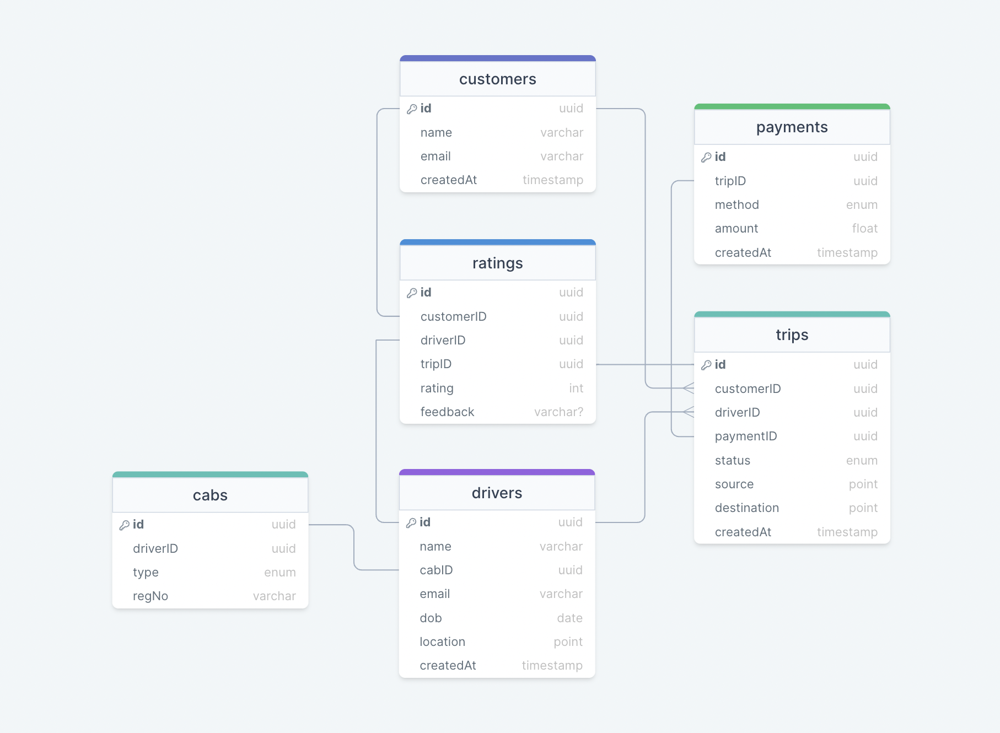
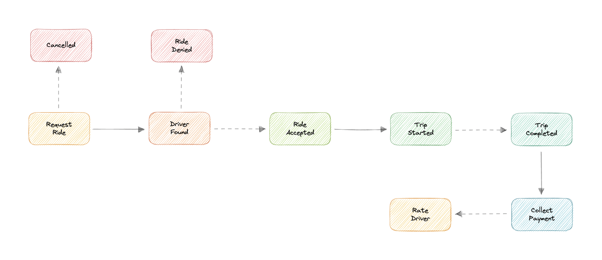
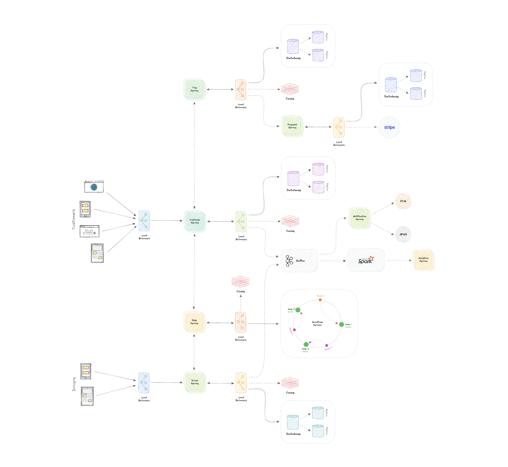

# Uber

Uber 怎样实时展示附近车辆、匹配司机并跟踪行程? 如何估算位置流量与存储? 地理哈希和四叉树怎样缩小候选集? 并发抢单、动态定价、支付和通知如何保证业务正确性?

Uber 是连接乘客与司机的移动出行平台。原材料把系统目标概括为：乘客请求行程、司机接受或拒绝、双方实时交换位置、完成支付并评价。下面的设计也适用于其他实时位置匹配平台。

## 需求

- 乘客: 查看附近车辆、ETA 与价格; 请求到目的地的行程; 实时查看司机位置;
- 司机: 接受或拒绝请求; 查看上车点; 开始并完成行程;
- 非功能: 高可靠、高可用、低延迟、可扩展;
- 扩展: 评价、支付、指标与分析;

## 量级假设

- 用户: 1 亿 DAU、100 万司机、1000 万行程/天;
- 流量: 每用户每天 10 次查车/估价/叫车等动作，共 10 亿请求/天，约 `12K/s`;
- 存储: 每动作平均 400 B，约 `400 GB/天`; 十年约 `1.4 PB`;
- 入口带宽: 约 `400 GB/天 ≈ 5 MB/s`;
- 位置更新: 原估算未单列高频 GPS 上报; 实际设计必须另算在线司机数 × 上报频率，它很可能才是主流量;

```text
每日业务动作 = 1 亿 DAU × 10 = 10 亿
平均请求 = 10 亿 / 86400 ≈ 12K/s
每日原始存储 = 10 亿 × 400 B ≈ 400 GB
十年原始存储 = 400 GB × 365 × 10 ≈ 1.4 PB
平均入口带宽 = 400 GB / 86400 ≈ 5 MB/s
```

| 指标         |    估算 |
| ------------ | ------: |
| DAU          |    1 亿 |
| 司机         |  100 万 |
| 每日行程     | 1000 万 |
| 平均业务请求 |   12K/s |
| 每日原始存储 |  400 GB |
| 十年原始存储 |  1.4 PB |
| 平均入口带宽 |  5 MB/s |

## 数据与 API

- `customers`、`drivers`: 用户资料;
- `cabs`: 车辆注册、类型与司机关系;
- `trips`: 起点、终点、司机、乘客、状态与价格;
- `ratings`: 行程评分与反馈;
- `payments`: 支付状态、第三方交易 ID 与 `tripID`;



`customers` 和 `drivers` 保存身份资料；`cabs` 保存注册号、Uber Go/Uber XL 等车型及司机关系；`trips` 保存起点、终点和状态；`ratings` 保存评分与反馈；`payments` 通过 `tripID` 关联支付。各服务拥有自己的数据，可分别选择 PostgreSQL 或 Cassandra，避免单库成为瓶颈。

```text
requestRide(customerID, source, destination, cabType, paymentMethod) -> Ride
cancelRide(customerID, reason?) -> boolean
acceptRide(driverID, rideID) -> boolean
denyRide(driverID, rideID) -> boolean
startTrip(driverID, tripID) -> boolean
endTrip(driverID, tripID) -> boolean
rateTrip(customerID, tripID, rating, feedback?) -> boolean
```

- `requestRide`：接收乘客 ID、起终点经纬度、车型和支付方式，返回 Ride;
- `cancelRide`：接收乘客和可选取消原因;
- `acceptRide` / `denyRide`：司机针对指定 ride 做决定;
- `startTrip` / `endTrip`：司机推动指定 trip 的生命周期;
- `rateTrip`：乘客对已完成行程给出整数评分和可选反馈。

## 服务边界与行程流

- Customer / Driver Service: 身份、资料与资格;
- Ride Service: 附近司机、ETA、定价、匹配与抢单;
- Trip Service: 行程状态机与历史;
- Payment Service: 支付意图、回调、对账与退款;
- Notification / Analytics Service: 推送与分析;

微服务之间可以使用 REST/HTTP 或更轻量的 gRPC，Service Discovery 或 Service Mesh 负责地址发现、可观测和安全通信。



1. 乘客提交起终点、车型和支付方式;
2. Ride Service 查询附近司机、计算 ETA 与报价，并广播请求;
3. 首个有效接受通过原子状态转换成为匹配司机;
4. 客户端经实时通道交换位置，司机开始并完成行程;
5. Payment Service 收款并以 webhook 确认最终结果;
6. 支付完成后允许评价;

完整顺序是：Ride Service 注册请求、查找附近司机并计算 ETA；请求广播给候选司机；司机接受后通知乘客司机实时位置和 ETA；接驾后开始行程；到达后司机完成行程并收款；支付确认后才开放评分。

## 位置通道

- WebSocket: 双向持续推送司机位置、ETA 与行程状态，避免轮询空响应;
- 后台定位: 移动端在许可范围内周期上报 GPS，并按速度、距离和电量动态调整频率;
- 最新位置: 放入 Redis 等内存存储并设置 TTL; 历史轨迹异步批量写入长期存储;
- 断线: 客户端重连后用行程版本和最后事件序号恢复，不把连接状态当业务事实;

拉模型依靠客户端周期性 HTTP/长轮询上报位置并获取 ETA、价格，许多响应为空且增加延迟。推模型建立长连接，服务端在数据到达时立即发送。WebSocket 是全双工通道，SSE 只有服务端到客户端单向传输，因此乘客和司机的双向实时位置更适合 WebSocket。移动应用还需要后台任务，在获得权限后即使退到后台也继续上报 GPS。

## 附近司机索引

- 直接 SQL 范围: `lat BETWEEN X-R AND X+R` 只能粗筛，数据大时扫描成本高且矩形不等于真实半径;
- 地理哈希: 把坐标编码为前缀，查询所在格与邻格，再计算精确距离;
- 四叉树: 密集区域递归细分，范围查询只访问相交节点; 适合动态二维点;
- 更新: 司机新位置到达时更新四叉树或地理索引，热点写先缓存再合并;
- 最终排序: 候选集按 ETA、车型、评分、接受率、司机公平性与供需排序;

SQL 粗筛示例：

```sql
SELECT * FROM locations
WHERE lat BETWEEN X-R AND X+R
  AND long BETWEEN Y-R AND Y+R;
```

该查询得到矩形候选区，数据量大时扫描慢，且仍需计算真实距离。

Geohash 使用 Base32 字母表，把世界递归划分为 32 个网格；每增加一个字符就提高精度。例如旧金山坐标 `37.7564, -122.4016` 可编码为 `9q8yy9mf`。查询时比较乘客与司机的 geohash 前缀，并覆盖相邻格，再做精确距离计算。司机 geohash 建索引并缓存在内存中。

四叉树的每个内部节点有四个子节点，用递归四分方式划分二维空间。只有点数超过阈值时才继续细分，可避免稀疏区域浪费。司机位置变化时更新四叉树；Redis 缓存最新更新以减轻树服务压力。Hilbert curve 等空间填充曲线还能帮助把二维邻近性映射到可排序的一维键上。

## 并发与定价

- 抢单竞态: 多司机同时接受时，用数据库条件更新、版本号或原子 compare-and-set 保证只有一个成功;
- 状态机: `requested → matched → arriving → in_progress → completed/cancelled`; 只允许合法转换;
- 事务边界: 匹配与行程状态在单一所有者内原子更新; 跨支付和通知用事件与幂等处理;
- 动态定价: 供不应求区域临时提高倍率，既调节需求也吸引供给; 必须透明、限幅并满足监管;

原材料建议用 Mutex 包裹匹配逻辑并让每个动作具备事务性。分布式部署中不能依赖单进程互斥锁，应使用数据库条件更新、版本号或分布式锁，把 `requested → matched` 变成一次原子状态转换。

得到附近司机后，可按平均评分、相关性和历史反馈排序，先向最佳候选广播。高需求时把 surge multiplier 加到基础价格上，临时提升价格以平衡有限供给。

## 支付与通知

- 支付: 使用 Stripe、PayPal 等处理器降低合规范围; 创建幂等支付意图，通过签名 webhook 获取最终状态;
- 不信任重定向: 用户返回页面不代表已付款，必须由服务端验证回调或主动查询;
- 通知: 事件进入消息代理，再由服务调用 FCM/APNS; 重试可能重复，使用通知 ID 去重;

Stripe、PayPal 等第三方处理器可以降低自建支付系统和合规复杂度。支付完成后处理器会把用户重定向回应用，同时通过 webhook 发送支付数据；业务状态必须以经过签名验证的 webhook 或主动查询为准，不能相信浏览器重定向。

Notification Service 消费 Kafka 等队列/代理中的事件，再调用 FCM 或 APNS。队列重试会产生重复，因此通知和状态处理都必须幂等。

## 分区、缓存与韧性

- 分区: 行程按地区或 ID 分片; 地区局部性好但热点不均，可结合哈希和再平衡;
- 缓存: 最新位置、附近候选与报价短期缓存; 位置 TTL 防止离线司机继续被匹配;
- 多实例: 服务、负载均衡、缓存、数据库和消息代理都跨故障域部署;
- 数据库: 读副本承担读取，主状态转换保持单一权威;
- 降级: 推荐排序异常时用距离排序; 分析和通知故障不阻塞行程状态;
- 观测: 定位新鲜度、匹配延迟、接受率、重复匹配、ETA 误差、支付未决与队列积压;

分片既可以使用通用哈希、列表、范围、复合策略，也可以按邮编等地区拆分。地区分片保留局部性，却可能因城市热度造成负载不均；一致性哈希和再平衡用于缓解。Redis/Memcached 缓存乘客和司机最近位置，LRU 淘汰冷数据，未命中回源并回填；位置还要设置 TTL，防止过期司机继续被匹配。



最终检查要覆盖：任一服务崩溃怎么办、组件之间怎样分流、如何降低数据库负载、缓存怎样高可用、通知怎样更可靠。核心措施是服务和缓存多实例、关键路径负载均衡、数据库读副本，以及 Kafka/NATS 等消息代理。严格恰好一次和全局顺序在分布式系统中困难，行程状态机、幂等键和局部顺序才是可执行的业务保证。
